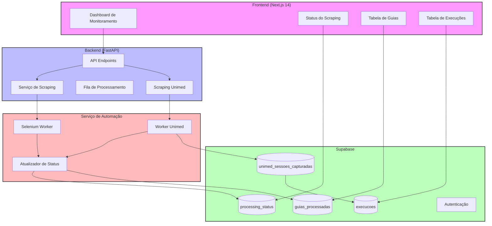
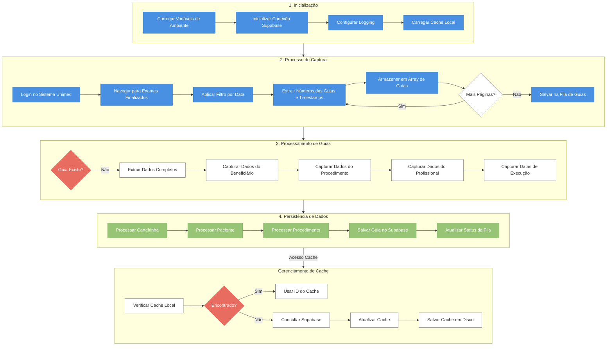
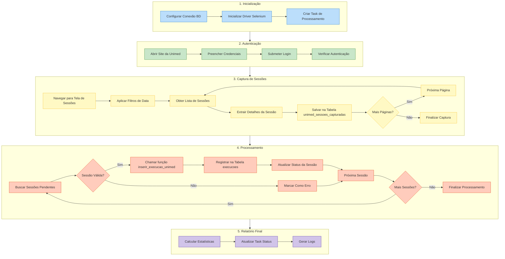

# Documentação Completa do Sistema de Scraping Unimed

Este documento unifica todos os diagramas de fluxo e instruções detalhadas para o sistema de automação de scraping da Unimed.

## Índice
1. [Diagrama Geral do Sistema](#diagrama-geral)
2. [Fluxo Original](#fluxo-original)
3. [Fluxo de Scraping da Unimed](#fluxo-scraping-unimed)
4. [Fluxo de Execução Detalhado](#fluxo-execucao-detalhado)
5. [Estrutura do Banco de Dados](#estrutura-banco-dados)
6. [Tabela Processing Status](#processing-status)
7. [Processo de Execução](#processo-execucao)
8. [Controle de Cache](#controle-cache)
9. [Status e Regras de Negócio](#status-regras-negocio)
10. [Atualizações Recentes](#atualizacoes-recentes)

## Diagrama Geral do Sistema

## Fluxo Original

## Fluxo de Scraping da Unimed (Abordagem Nova)

## Fluxo de Execução Detalhado

### 1. Inicialização
- Carrega variáveis de ambiente (.env)
- Inicializa conexão com Supabase
- Configura logging
- Carrega cache local (cache_unimed.json)

### 2. Processo de Captura (capture_guides)
1. Login no sistema Unimed
2. Navega para tela de exames finalizados
3. Aplica filtro por data (start_date até end_date)
4. Para cada página de resultados:
   - Extrai número da guia e data/hora do atendimento
   - Armazena em captured_guides[]
   - Avança para próxima página se existir
5. Salva guias capturadas na tabela guias_queue:
   - Gera task_id único
   - Cria registro em processing_status
   - Insere cada guia em guias_queue com status 'pendente'

### 3. Processamento de Guias (process_single_guide)
Para cada guia em captured_guides:
1. Verifica se guia já existe:
   - Checa guias_queue (numero_guia + data_execucao)
   - Checa tabela guias (numero_guia)
2. Se não existe:
   - Extrai dados completos da guia
   - Captura informações do beneficiário
   - Captura dados do procedimento
   - Captura dados do profissional
   - Captura datas de execução

### 4. Persistência dos Dados (Novo Fluxo com Tabela Intermediária)
1. Carteirinha, Paciente e Procedimento (como antes)
   - Verifica cache local
   - Busca/cria no Supabase
   - Atualiza cache

2. Salvar execução (save_unimed_execution - Nova versão):
   - Prepara dados para tabela `unimed_sessoes_capturadas` (incluindo `ordem_execucao`)
   - Insere na tabela intermediária com status "pendente"
   - Chama a função SQL `inserir_execucao_unimed`
   - A função SQL:
     - Busca dados completos da sessão
     - Localiza a guia correspondente
     - Tenta vincular à `sessoes` usando `numero_guia`, `data` e `ordem_execucao`
     - Insere na tabela final `execucoes` (com `sessao_id` preenchido se vinculado)
     - Atualiza status da sessão para "processado"
     - Gera log detalhado em `unimed_log_processamento`

3. Verificação de Processamento (verificar_processamento_sessoes - Novo):
   - Consulta estatísticas das sessões desta task
   - Gera relatório com totais de sessões processadas/com erro/pendentes
   - Atualiza status final na tabela `processing_status`

## Estrutura do Banco de Dados

### Tabelas Principais
1. **processing_status**: Controle geral das tarefas de processamento
2. **guias_queue**: Fila de guias para processamento
3. **unimed_sessoes_capturadas**: Armazena os dados brutos capturados do site da Unimed (Nova), incluindo `ordem_execucao`
4. **unimed_log_processamento**: Logs detalhados do processamento das sessões (Nova)
5. **execucoes**: Tabela final onde os dados processados são inseridos, incluindo `ordem_execucao` e `sessao_id` (se vinculado)

### Relacionamentos
- **processing_status (1) → (N) guias_queue**: Uma task processa múltiplas guias
- **processing_status (1) → (N) unimed_sessoes_capturadas**: Uma task processa múltiplas sessões
- **unimed_sessoes_capturadas (1) → (1) execucoes**: Uma sessão capturada gera uma execução
- **unimed_sessoes_capturadas (1) → (N) unimed_log_processamento**: Uma sessão pode ter múltiplos logs

## Tabela Processing Status

### Propósito
A tabela `processing_status` serve como um "log de execução" do script, registrando cada vez que o script é executado e seu progresso. Funciona como o centro de controle para todo o processo de scraping, mantendo informações cruciais sobre o estado atual, progresso e resultados.

### Campos Principais
- **id**: UUID único para cada registro
- **task_id**: Identificador único e legível de cada execução (ex: task_20250128_100118_1634)
- **status**: Estado atual do processamento (ver ciclo de status abaixo)
- **total_guides**: Número total de guias encontradas para processar
- **processed_guides**: Número de guias efetivamente processadas
- **retry_guides**: Número de guias que falharam e precisam ser reprocessadas
- **total_execucoes**: Total de execuções registradas (pode ser maior que processed_guides)
- **error**: Mensagem de erro detalhada (se houver)
- **created_at**: Timestamp de criação do registro
- **updated_at**: Timestamp da última atualização
- **completed_at**: Timestamp de finalização
- **started_at**: Timestamp de início efetivo do processamento
- **error_at**: Timestamp do erro (se ocorrer)
- **last_update**: Timestamp da última atualização de status
- **start_date**: Data inicial do período filtrado (formato dd/mm/yyyy)
- **end_date**: Data final do período filtrado (formato dd/mm/yyyy)
- **max_guides**: Limite máximo de guias a processar (opcional)

### Ciclo de Status Completo
1. **pending**: Status inicial quando o registro é criado
2. **iniciado**: Script começou a executar
3. **capturing**: Durante a fase de captura das guias
4. **processing**: Durante o processamento das guias capturadas
5. **finalizado/completed**: Todas guias processadas com sucesso
6. **completed_with_errors**: Processamento finalizado, mas algumas guias tiveram erro
7. **error**: Erro crítico durante o processamento

### Análise de Registros Típicos

| status  | total_guides | processed_guides | observação                               |
|---------|--------------|------------------|------------------------------------------|
| queued  | 2           | 0                | Script interrompido após enfileirar      |
| queued  | 2           | 0                | Script interrompido após enfileirar      |
| queued  | 2           | 0                | Script interrompido após enfileirar      |
| error   | 16          | 16               | Script completou mas com erros           |
| completed | 25        | 25               | Processamento completo bem-sucedido      |
| completed_with_errors | 30 | 27          | Processamento completado, 3 guias com erro |

### Interpretação dos Registros
1. Os registros com status "queued" e processed_guides = 0:
   - Script conseguiu capturar 2 guias
   - Enfileirou na guias_queue
   - Não chegou a processar nenhuma
   - Possivelmente interrompido antes do processamento

2. O registro com status "error" e processed_guides = 16:
   - Script encontrou 16 guias para processar
   - Conseguiu processar todas (processed_guides = 16)
   - Mas encontrou erros durante o processamento
   - Provavelmente erros de duplicidade ou validação

3. O registro com status "completed_with_errors":
   - Encontrou 30 guias e processou 27
   - 3 guias tiveram erros permanentes
   - O script conseguiu finalizar apesar disso

### Atualizações com a Nova Abordagem
Na nova abordagem com tabela intermediária, o `processing_status` recebe atualizações adicionais:

1. O campo `total_execucoes` passa a registrar o total de sessões em `unimed_sessoes_capturadas`
2. O campo `processed_guides` reflete as sessões com status "processado"
3. O campo `retry_guides` contabiliza as sessões com status "erro"
4. Um novo método `verificar_processamento_sessoes()` atualiza essas estatísticas ao final do processamento

### Recomendações
1. Limpar registros antigos periodicamente (manter apenas os últimos 30 dias)
2. Investigar registros com status "error" para identificar problemas recorrentes
3. Monitorar registros "iniciado"/"capturing" que não progrediram (interrompidos)
4. Usar a view `processing_status_report` para análise consolidada de desempenho

## Processo de Execução

### Estados de Processamento (processing_status)
- **pending**: Estado inicial
- **iniciado**: Script iniciou execução
- **capturing**: Coletando guias
- **processing**: Processando guias
- **finalizado/completed**: Todas processadas com sucesso
- **completed_with_errors**: Algumas falharam
- **error**: Erro geral no processamento

### Estados das Sessões (unimed_sessoes_capturadas)
- **pendente**: Aguardando processamento
- **processado**: Inserido na tabela execucoes com sucesso
- **erro**: Falha no processamento (detalhes no campo error)

### Controle de Execução
1. **Criação do Task**:
   - Gera task_id único
   - Status inicial "iniciado"
   - Registra parâmetros (datas, máximo de guias)

2. **Captura**:
   - Status muda para "capturing"
   - Insere guias na fila
   - Insere sessões capturadas na tabela intermediária (incluindo `ordem_execucao`)

3. **Processamento**:
   - Status muda para "processing"
   - Chama função SQL para cada sessão (`inserir_execucao_unimed`)
   - Função SQL tenta vincular usando `numero_guia`, `data` e `ordem_execucao`
   - Atualiza status de cada sessão
   - Gera logs detalhados

4. **Finalização**:
   - Gera estatísticas finais
   - Registra completed_at
   - Define status final baseado no resultado

## Controle de Cache

### Cache Local (cache_unimed.json)
- Reduz consultas ao Supabase
- Mantém IDs de:
  - carteirinhas
  - pacientes
  - procedimentos
- Persiste entre execuções

### Ciclo de Vida do Cache
1. **Inicialização**
   - Carrega cache do arquivo cache_unimed.json
   - Se arquivo não existe, cria cache vazio

2. **Uso do Cache**
   - Antes de qualquer consulta ao Supabase, verifica cache local
   - Se encontra ID no cache, usa direto (evita consulta)
   - Se não encontra, busca no Supabase e atualiza cache

3. **Atualização do Cache**
   - Quando cria novo registro: adiciona ao cache
   - Atualiza timestamp de uso
   - Após cada atualização, salva cache em disco

4. **Limpeza Automática**
   - Remove entradas não usadas há mais de 30 dias
   - Realizada durante save_cache()

## Status de Guias e Regras de Negócio

### Estados Possíveis das Guias
- **rascunho**: Estado inicial da guia
- **pendente_autorizacao**: Aguardando autorização
- **em_andamento**: Guia com pelo menos uma sessão executada
- **suspensa**: PEI da guia vencido (Data solicitação + 120 dias)
- **concluida**: Quantidade de sessões executadas atingiu o autorizado
- **cancelada**: Guia não localizada na base (possível cancelamento ou finalização)
- **expirada**: Guia atingiu sua data de validade

### Observações Importantes
1. Mudanças de status são realizadas manualmente devido a:
   - Possibilidade de finalização equivocada da guia
   - Execuções em outros prestadores afetando saldo disponível
   - Necessidade de análise humana para determinar status real

2. Regras de Negócio
   - Status 'em_andamento' só é atribuído após primeira execução
   - Status 'suspensa' considera regra da Unimed (Data solicitação + 120 dias)
   - Status 'cancelada' requer verificação manual
   - Status 'concluida' requer confirmação manual

3. Vantagens da Nova Abordagem com Tabela Intermediária
   - Preservação dos dados brutos para auditoria
   - Possibilidade de reprocessamento em caso de erros
   - Separação clara entre captura e processamento
   - Rastreabilidade completa do processo
   - Geração de estatísticas detalhadas 

## Atualizações Recentes

### Migração de campos
1. **Substituição do campo `codigo_aba`**:
   - O campo `codigo_aba` foi removido do processo de scraping
   - Todas as referências foram substituídas pelo campo `id_origem`
   - Ao criar novos pacientes, utilizamos o formato `id_origem: "UNIMED_{numero_carteira}"`
   - Esta mudança alinha o scraping com a estrutura atual do banco de dados

2. **Campos de data**:
   - Padronização do campo `data_atendimento_completa` no formato "dd/mm/aaaa hh:mm"
   - Este campo é usado como identificador único junto com o número da guia
   - Garante consistência na identificação de sessões únicas

### Impacto nas funções principais
1. **get_or_create_paciente**:
   - Agora utiliza apenas `id_origem` como identificador único
   - Não faz mais referência ao campo `codigo_aba`
   - Mantém compatibilidade com o restante do sistema

2. **get_or_create_carteirinha**:
   - Ao criar um novo paciente, define apenas `id_origem`
   - Formato padronizado: `"UNIMED_{numero_carteira}"`
   - Simplifica o processo de criação de pacientes

3. **save_unimed_execution**:
   - Utiliza o formato padronizado para datas
   - Garante consistência nos registros de execução

### Benefícios das alterações
1. **Simplificação do código**:
   - Remoção de campos redundantes
   - Alinhamento com a estrutura atual do banco de dados

2. **Melhoria na rastreabilidade**:
   - Identificação consistente de pacientes via `id_origem`
   - Formato padronizado para datas de atendimento

3. **Redução de erros**:
   - Eliminação de conflitos por duplicidade de campos
   - Validação mais precisa de registros existentes 

### Captura de Ordem de Execução (Implementado)
1. **Captura no Scraping**:
   - A função `get_execution_dates` no script `todas_as_fases_adaptado.py` foi confirmada para capturar a ordem numérica de cada execução listada na tela "Data de Procedimentos em Série" da Unimed.
   - Esta ordem é armazenada no campo `ordem_execucao`.

2. **Armazenamento Intermediário**:
   - Ao salvar os dados na tabela `unimed_sessoes_capturadas` (função `save_unimed_execution`), o campo `ordem_execucao` é incluído.

3. **Uso na Vinculação**:
   - A função SQL `inserir_execucao_unimed` foi refatorada para usar o campo `ordem_execucao` (juntamente com `numero_guia` e `data_execucao`) como critério primário ao tentar encontrar a `sessao` correspondente na tabela `sessoes`.
   - Isso aumenta significativamente a precisão da vinculação automática entre as execuções da Unimed e as sessões registradas nas fichas físicas, especialmente em casos de múltiplas sessões no mesmo dia.
   - A função também define o campo `link_manual_necessario` na tabela `execucoes` se a vinculação automática falhar ou for ambígua.

   - Validação mais precisa de registros existentes 