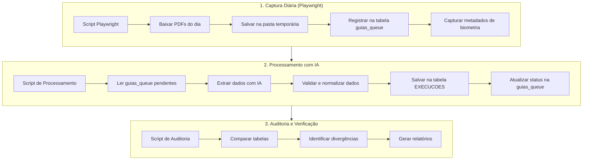

# Fluxo Atualizado do Sistema de Captura de Guias Unimed

Este documento descreve o novo fluxo de captura e processamento de guias da Unimed utilizando Playwright e processamento com IA.

## Visão Geral do Novo Fluxo



## 1. Processo de Captura com Playwright

### Execução Diária Automatizada

O sistema agora utiliza a biblioteca Playwright para automação de navegador, substituindo a solução anterior em Selenium. O script `baixar_multiplas_guias.py` é executado diariamente através de uma tarefa agendada.

### Fluxo de Captura:

1. **Inicialização:**
   - Carrega variáveis de ambiente (credenciais da Unimed)
   - Configura o Playwright para navegação headless
   - Cria uma task_id única para o processamento diário

2. **Login e Navegação:**
   - Realiza login no portal da Unimed
   - Navega até a seção de guias/atendimentos

3. **Listagem de Guias Disponíveis:**
   - Executa `listar_guias_disponiveis.py` para a data atual
   - Captura informações básicas de todas as guias disponíveis:
     - Número da guia
     - Data e hora do atendimento
     - Informações adicionais
     - **Status de biometria** (novo)

4. **Captura do Status de Biometria:** (novo)
   - Para cada guia na listagem:
     - Identifica o ícone de biometria usando o seletor apropriado
     - Extrai o status baseado na imagem apresentada e texto alt
     - Armazena este dado junto com as informações da guia

5. **Download dos PDFs:**
   - Para cada guia identificada:
     - Executa `baixar_pdf_guia()` com o número da guia e data
     - Salva o PDF na pasta `guias_pdf` com nomenclatura padronizada: `{numero_guia}_{data_atendimento}.pdf`

6. **Registro no Banco de Dados:**
   - Para cada PDF baixado com sucesso:
     - Insere um registro na tabela `guias_queue` com status "pendente_processamento"
     - Armazena informações como:
       - task_id (identificador do lote)
       - numero_guia
       - data_atendimento
       - caminho_arquivo
       - **status_biometria** (novo)
       - tipo_biometria
       - status
       - created_at
       - updated_at

7. **Geração de Relatório:**
   - Registra estatísticas finais na tabela `processing_status`:
     - Total de guias encontradas
     - Total de PDFs baixados com sucesso
     - Guias com erro (falha no download)
     - Status geral da operação

## 2. Processamento com IA

Após o download diário das guias, um segundo script (ainda a ser implementado) se encarregará de processar os PDFs utilizando IA para extração de dados.

### Fluxo de Processamento:

1. **Inicialização do Processador:**
   - Configura conexão com Supabase
   - Configura conexão com a API de IA (Claude)
   - Carrega configurações de extração

2. **Seleção de Guias para Processamento:**
   - Consulta tabela `guias_queue` para guias com status "pendente_processamento"
   - Organiza fila de processamento por prioridade/data

3. **Extração de Dados com IA:**
   - Para cada PDF na fila:
     - Abre o arquivo PDF do caminho registrado
     - Envia para API de IA (Claude) para extração de dados estruturados
     - Recebe JSON com dados extraídos:
       - Dados do paciente
       - Número da carteirinha
       - Dados do profissional
       - Procedimento realizado
       - Data e hora da execução
       - Outras informações relevantes

4. **Validação e Normalização:**
   - Valida os dados extraídos pela IA
   - Normaliza formatos (datas, nomes, números)
   - Verifica consistência e completude
   - Identifica possíveis erros ou ambiguidades

5. **Persistência dos Dados:**
   - Armazena dados intermediários na tabela `unimed_sessoes_capturadas` para rastreabilidade, incluindo:
     - Todos os dados extraídos do PDF
     - **Status de biometria** obtido durante a captura (novo)
   - Insere dados processados diretamente na tabela `EXECUCOES` do sistema principal, incluindo:
     - Dados normalizados para o sistema principal
     - **Campo de validação biométrica** (novo)
   - Atualiza status na tabela `guias_queue` para:
     - "processado" (em caso de sucesso)
     - "erro_processamento" (em caso de falha)
     - "dados_incompletos" (extração parcial)

6. **Geração de Logs Detalhados:**
   - Registra detalhes do processamento na tabela `unimed_log_processamento`
   - Armazena confiança da extração e possíveis alternativas
   - Documenta decisões tomadas pelo algoritmo

## 3. Sistema de Auditoria

Após a inserção dos dados na tabela EXECUCOES, um script de auditoria será responsável por verificar a consistência dos dados.

### Fluxo de Auditoria:

1. **Comparação de Tabelas:**
   - Compara os dados inseridos na tabela `EXECUCOES` com outras tabelas do sistema
   - Verifica consistência entre registros de diferentes fontes
   - Identifica possíveis divergências ou anomalias

2. **Análise de Divergências:**
   - Categoriza tipos de divergências encontradas
   - Avalia severidade e impacto das inconsistências
   - Determina ações necessárias para cada tipo de divergência

3. **Geração de Relatórios:**
   - Produz relatórios detalhados de auditoria
   - Fornece dashboards para visualização de métricas de qualidade
   - Alerta sobre problemas que requerem intervenção manual

4. **Correção Automática:**
   - Para divergências simples, aplica correções automáticas
   - Registra todas as alterações em log de auditoria
   - Mantém histórico completo de modificações

## Estrutura de Tabelas

### Tabela `guias_queue`

```sql
CREATE TABLE guias_queue (
    id UUID PRIMARY KEY DEFAULT uuid_generate_v4(),
    task_id VARCHAR NOT NULL,
    numero_guia VARCHAR NOT NULL,
    data_atendimento VARCHAR NOT NULL,
    caminho_arquivo VARCHAR NOT NULL,
    status_biometria VARCHAR, -- Novo campo
    tipo_biometria VARCHAR, -- Novo campo para diferenciar digital/facial
    status VARCHAR NOT NULL DEFAULT 'pendente_processamento',
    dados_extraidos JSONB,
    error TEXT,
    created_at TIMESTAMP WITH TIME ZONE DEFAULT NOW(),
    updated_at TIMESTAMP WITH TIME ZONE DEFAULT NOW(),
    processed_at TIMESTAMP WITH TIME ZONE,
    UNIQUE(numero_guia, data_atendimento)
);
```

### Tabela `unimed_sessoes_capturadas`

```sql
CREATE TABLE unimed_sessoes_capturadas (
    id UUID PRIMARY KEY DEFAULT uuid_generate_v4(),
    guia_queue_id UUID REFERENCES guias_queue(id),
    numero_guia VARCHAR NOT NULL,
    data_atendimento VARCHAR NOT NULL,
    numero_carteirinha VARCHAR,
    nome_paciente VARCHAR,
    codigo_procedimento VARCHAR,
    nome_procedimento VARCHAR,
    profissional VARCHAR,
    status_biometria VARCHAR, -- Novo campo
    tipo_biometria VARCHAR, -- Novo campo para diferenciar digital/facial
    dados_completos JSONB,
    status VARCHAR NOT NULL DEFAULT 'pendente',
    confianca_extracao FLOAT,
    error TEXT,
    created_at TIMESTAMP WITH TIME ZONE DEFAULT NOW(),
    updated_at TIMESTAMP WITH TIME ZONE DEFAULT NOW(),
    execucao_id UUID,
    UNIQUE(numero_guia, data_atendimento)
);
```

### Tabela `processing_status`

Mantém a estrutura existente com pequenas adições:

```sql
-- Adições à tabela processing_status
ALTER TABLE processing_status ADD COLUMN IF NOT EXISTS 
    total_pdfs_baixados INTEGER DEFAULT 0;
ALTER TABLE processing_status ADD COLUMN IF NOT EXISTS 
    total_extraidos_sucesso INTEGER DEFAULT 0;
ALTER TABLE processing_status ADD COLUMN IF NOT EXISTS 
    total_com_erro_extracao INTEGER DEFAULT 0;
```

## Implementação da Captura de Biometria

### Identificação do Status de Biometria

O status de biometria é representado por um ícone na interface da Unimed. No exemplo da página de guias executadas, o elemento pode ser identificado pelo seguinte seletor:

```xpath
//*[@id="conteudo"]/form[2]/table/tbody/tr[2]/td[7]/span[2]/a/img
```

Ou com um seletor CSS mais simples:

```css
#conteudo form table tr td span a img[alt*="biometria"]
```

### Tipos de Status Possíveis

Baseado nos atributos da imagem e texto alt, identificamos os seguintes status:

1. **Biometria Digital**:
   - Alt: "Leitura biométrica efetuada com sucesso"
   - Imagem: `ico16biometria-digital-sucesso.png`
   - Valor a ser armazenado:
     - status_biometria: "sucesso"
     - tipo_biometria: "digital"

2. **Biometria Facial com Sucesso**:
   - Alt: "Leitura biométrica facial executada com sucesso"
   - Imagem: `ico16biometria-facial-sucesso.png`
   - Valor a ser armazenado:
     - status_biometria: "sucesso"
     - tipo_biometria: "facial"

3. **Erro na Biometria Facial**:
   - Alt: "Problema ao efetuar a leitura biométrica facial"
   - Imagem: `ico16biometria-facial-erro.png`
   - Valor a ser armazenado:
     - status_biometria: "erro"
     - tipo_biometria: "facial"
     
4. **Biometria Não Realizada**:
   - Alt: "Leitura biométrica não realizada"
   - Valor a ser armazenado:
     - status_biometria: "nao_realizada"
     - tipo_biometria: "nenhum"

5. **Sem Informação de Biometria**:
   - Ausência do ícone de biometria
   - Valor a ser armazenado:
     - status_biometria: "desconhecido"
     - tipo_biometria: "nenhum"

### Código para Captura (Python com Playwright)

```python
def capturar_status_biometria(page, guia_row):
    """
    Captura o status de biometria de uma linha de guia na tabela de guias da Unimed.
    
    Args:
        page: Objeto page do Playwright
        guia_row: Elemento da linha da tabela (tr)
        
    Returns:
        dict: Dicionário com status_biometria e tipo_biometria
    """
    # Tenta encontrar o ícone de biometria na linha da guia
    biometria_icon = guia_row.query_selector('td span a img[alt*="biometria"]')
    
    if not biometria_icon:
        return {
            "status_biometria": "desconhecido",
            "tipo_biometria": "nenhum"
        }
    
    # Extrai o atributo alt e src para determinar o status
    alt_text = biometria_icon.get_attribute('alt')
    src = biometria_icon.get_attribute('src')
    
    # Analisa o status baseado no texto e imagem
    if "facial executada com sucesso" in alt_text or "facial-sucesso" in src:
        return {
            "status_biometria": "sucesso",
            "tipo_biometria": "facial"
        }
    elif "efetuada com sucesso" in alt_text or "digital-sucesso" in src:
        return {
            "status_biometria": "sucesso",
            "tipo_biometria": "digital"
        }
    elif "Problema" in alt_text or "erro" in src:
        return {
            "status_biometria": "erro",
            "tipo_biometria": "facial"
        }
    elif "não realizada" in alt_text:
        return {
            "status_biometria": "nao_realizada",
            "tipo_biometria": "nenhum"
        }
    else:
        return {
            "status_biometria": "desconhecido",
            "tipo_biometria": "nenhum"
        }
```

### Implementação em `listar_guias_disponiveis.py`

```python
def listar_guias_disponiveis(data_atendimento, salvar=False):
    """
    Lista as guias disponíveis para uma data específica.
    
    Args:
        data_atendimento: Data no formato dd/mm/aaaa
        salvar: Se True, salva os resultados em CSV
        
    Returns:
        list: Lista de dicionários com informações das guias
    """
    # Código existente...
    
    # Para cada linha da tabela
    guias = []
    for row in rows:
        # Extrair dados básicos da guia
        numero_guia = row.query_selector('td:nth-child(2)').inner_text().strip()
        data_hora = row.query_selector('td:nth-child(1)').inner_text().strip()
        beneficiario = row.query_selector('td:nth-child(3)').inner_text().strip()
        
        # Capturar status de biometria
        biometria_info = capturar_status_biometria(page, row)
        
        guia_info = {
            "numero_guia": numero_guia,
            "data": data_hora.split()[0],
            "hora": data_hora.split()[1] if len(data_hora.split()) > 1 else "",
            "beneficiario": beneficiario,
            "status_biometria": biometria_info["status_biometria"],
            "tipo_biometria": biometria_info["tipo_biometria"]
        }
        guias.append(guia_info)
    
    # Código existente para paginação, etc...
    
    return guias
```

## Diferenças com o Fluxo Anterior

### 1. Separação de Responsabilidades
- **Antes**: Um único script em Selenium fazia todo o processo (captura + processamento)
- **Agora**: Múltiplos scripts especializados - captura com Playwright, processamento com IA, e auditoria

### 2. Armazenamento de PDFs
- **Antes**: Não armazenava os PDFs originais, apenas extraía dados
- **Agora**: Salva os PDFs em pasta temporária para processamento posterior e auditoria

### 3. Uso de IA para Extração
- **Antes**: Extração baseada em seletores HTML e regras fixas
- **Agora**: Extração com IA adaptativa que entende o conteúdo dos PDFs

### 4. Captura de Metadados Adicionais (novo)
- **Antes**: Não capturava o status de biometria
- **Agora**: Captura e armazena informações detalhadas sobre biometria (status e tipo)
- **Agora**: Propaga dados de biometria por todo o fluxo até a tabela EXECUCOES

### 5. Persistência de Dados
- **Antes**: Dados intermediários não eram armazenados
- **Agora**: Armazena dados em `unimed_sessoes_capturadas` para rastreabilidade
- **Agora**: Insere diretamente na tabela `EXECUCOES` do sistema principal

### 6. Auditoria Automatizada
- **Antes**: Auditoria manual ou inexistente
- **Agora**: Sistema automatizado para comparação de tabelas e detecção de divergências

### 7. Robustez e Rastreabilidade
- **Antes**: Processo frágil dependente da estrutura HTML
- **Agora**: Maior robustez com controle detalhado do processamento
- Rastreabilidade completa do arquivo original à execução

### 8. Eficiência
- **Antes**: Processamento sequencial e síncrono
- **Agora**: Possibilidade de paralelizar o processamento com IA

## Próximos Passos

1. **Implementação do Processador IA**:
   - Desenvolver script Python para processar PDFs
   - Integrar com API Claude para extração inteligente
   - Implementar validações de qualidade

2. **Desenvolvimento do Sistema de Auditoria**:
   - Criar lógica de comparação entre tabelas
   - Desenvolver algoritmos para detecção de anomalias
   - Implementar sistema de alertas

3. **Dashboard de Monitoramento**:
   - Criar interface para acompanhar estatísticas
   - Visualizar PDFs e dados extraídos
   - Corrigir manualmente extrações com problemas

4. **Otimizações**:
   - Paralelização do processamento
   - Cache de resultados similares
   - Melhoria contínua do modelo de IA 