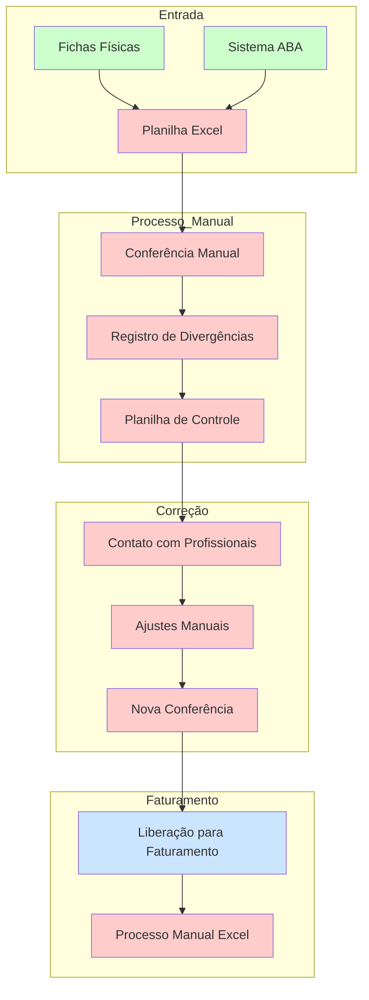
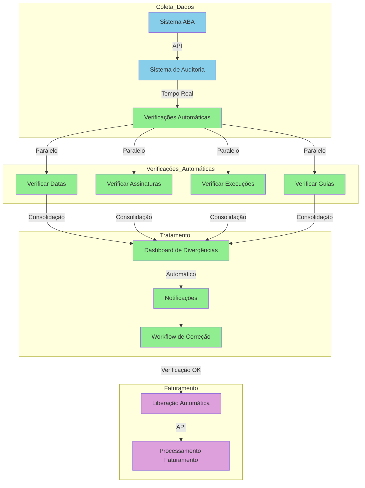

# Diagnóstico do Processo de Faturamento e Auditoria
## Sumário Executivo

Este documento apresenta uma análise detalhada do processo atual de faturamento e auditoria da clínica, identificando vulnerabilidades críticas e apresentando soluções através do novo sistema de gestão integrado.

## 1. Situação Atual e Vulnerabilidades

### 1.1. Processo de Faturamento
#### Vulnerabilidades Identificadas:
1. **Dependência Crítica de Pessoa**
   - Processo centralizado em um único funcionário
   - Conhecimento não documentado e não transferível
   - Alto risco operacional em caso de ausência do funcionário
   - Ausência de backup humano para o processo
   - Impossibilidade de crescimento operacional
   - Risco de perda total do conhecimento em caso de desligamento

2. **Fragilidade Tecnológica**
   - Utilização de planilhas Excel com macros complexas
   - Ausência de versionamento e backup adequado
   - Risco de perda de dados por falhas no arquivo
   - Dificuldade de manutenção e atualização
   - Fórmulas complexas sem documentação
   - Ausência de controle de versão
   - Vulnerabilidade a erros de fórmulas
   - Limitações de processamento do Excel
   - Risco de corrupção de arquivos

3. **Limitações Operacionais**
   - Processo manual e propenso a erros
   - Sem integração com outros sistemas
   - Tempo excessivo para processamento
   - Ausência de validações automáticas
   - Dificuldade em escalar o processo
   - Impossibilidade de processamento em lote
   - Falta de padronização nos processos
   - Ausência de trilha de auditoria
   - Dificuldade em manter histórico de alterações

### 1.2. Processo de Auditoria
#### Vulnerabilidades Identificadas:
1. **Processo Manual Ineficiente**
   - Conferência manual de fichas físicas
   - Digitação manual em planilhas
   - Alto risco de erro humano
   - Tempo excessivo para execução
   - Impossibilidade de verificação em massa
   - Dificuldade em manter padrão de verificação
   - Ausência de critérios objetivos
   - Processo repetitivo e desgastante
   - Alta taxa de erro em verificações longas

2. **Rastreabilidade Limitada**
   - Dificuldade em acompanhar histórico de alterações
   - Ausência de registro de responsabilidades
   - Falta de trilha de auditoria
   - Impossibilidade de verificar autor das alterações
   - Sem registro temporal das modificações
   - Dificuldade em reverter alterações incorretas
   - Ausência de log de atividades
   - Sem controle de acesso por usuário
   - Impossibilidade de auditoria do próprio processo

3. **Controle de Qualidade**
   - Ausência de validações automáticas
   - Dificuldade em identificar padrões de erro
   - Sem métricas de qualidade do processo
   - Impossibilidade de prevenção de erros
   - Falta de alertas automáticos
   - Sem verificação cruzada de dados
   - Ausência de indicadores de performance
   - Dificuldade em medir eficiência
   - Sem padrões de qualidade estabelecidos

### 1.4. Riscos Financeiros
1. **Perda de Receita**
   - Possibilidade de sessões não faturadas
   - Erros em valores cobrados
   - Glosas por inconsistências documentais
   - Atrasos no faturamento
   - Perda de prazos de envio
   - Retrabalho por erros de processo
   - Custos extras com correções
   - Impossibilidade de previsão financeira
   - Fluxo de caixa comprometido

2. **Compliance e Auditoria**
   - Risco de não conformidade com requisitos dos convênios
   - Dificuldade em responder a auditorias externas
   - Falta de padronização nos processos
   - Ausência de documentação de processos
   - Dificuldade em comprovar execuções
   - Risco de penalidades contratuais
   - Possibilidade de descredenciamento
   - Exposição a riscos regulatórios
   - Dificuldade em adequar processos

## 2. Solução Proposta

### 2.1. Sistema Integrado de Gestão
O novo sistema está sendo desenvolvido com tecnologias modernas e robustas:
- Frontend em Next.js 14
- Backend em FastAPI (Python)
- Banco de dados PostgreSQL com Supabase
- Autenticação segura via Supabase Auth

### 2.2. Funcionalidades Principais
1. **Automação do Faturamento**
   - Integração com múltiplos convênios
   - Processamento automático de guias
   - Validações em tempo real
   - Geração automatizada de relatórios

2. **Sistema de Auditoria Automatizado**
   - Verificação automática de divergências
   - Tipos de verificações implementadas:
     - Datas divergentes
     - Sessões sem assinatura
     - Execuções sem sessão correspondente
     - Sessões sem execução registrada
     - Quantidade excedida de sessões
     - Guias vencidas
     - Duplicidade de execuções

3. **Controles e Validações**
   - Monitoramento em tempo real
   - Alertas automáticos de divergências
   - Trilha de auditoria completa
   - Gestão de status e prioridades

## 3. Benefícios Esperados

### 3.1. Ganhos Operacionais
- Redução significativa do tempo de processamento
- Eliminação de erros por processamento manual
- Descentralização do conhecimento
- Padronização dos processos

### 3.2. Ganhos Financeiros
- Redução de glosas
- Aumento na assertividade do faturamento
- Melhor controle do fluxo de caixa
- Redução de custos operacionais

### 3.3. Ganhos Estratégicos
- Sistema preparado para crescimento
- Adaptável a novos convênios
- Base para análises estratégicas
- Conformidade com requisitos regulatórios

## 4. Próximos Passos e Recomendações
1. Priorizar a implementação do módulo de faturamento
2. Realizar treinamento da equipe no novo sistema
3. Estabelecer período de operação paralela para validação
4. Definir métricas de sucesso para acompanhamento
5. Planejar expansão para outros convênios

## 4. Tipos de Divergências e Processos de Verificação

### 4.1 Categorias de Verificações Automáticas

1. **Inconsistências de Datas**
   - Verificação automática entre datas de agendamento e execução
   - Identificação de inconsistências temporais
   - Prevenção de erros de faturamento relacionados a datas

2. **Validação de Documentação**
   - Verificação da completude das assinaturas necessárias
   - Garantia de conformidade documental
   - Redução de glosas por documentação incompleta

3. **Controle de Execuções**
   - Monitoramento da correspondência entre sessões agendadas e realizadas
   - Identificação de lacunas no registro de atendimentos
   - Garantia de faturamento completo dos serviços prestados

4. **Gestão de Autorizações**
   - Controle automático de quantidades autorizadas
   - Monitoramento de limites de sessões
   - Alertas preventivos de excedentes

5. **Controle de Validade**
   - Acompanhamento automático da validade das autorizações
   - Alertas antecipados de vencimento
   - Prevenção de atendimentos com guias vencidas

6. **Prevenção de Duplicidades**
   - Identificação automática de registros duplicados
   - Garantia de unicidade nos lançamentos
   - Prevenção de cobranças duplicadas

### 4.2 Benefícios do Processo Automatizado

1. **Ganhos Financeiros**
   - Redução significativa de glosas
   - Aumento da assertividade no faturamento
   - Otimização do fluxo de recebíveis

2. **Eficiência Operacional**
   - Redução do tempo de processamento
   - Diminuição de retrabalho
   - Aumento da produtividade da equipe

3. **Conformidade e Qualidade**
   - Garantia de aderência às regras dos convênios
   - Padronização dos processos de verificação
   - Melhoria contínua da qualidade dos registros

4. **Gestão Estratégica**
   - Visibilidade em tempo real das operações
   - Suporte à tomada de decisão
   - Base para planejamento estratégico

## 5. Comparativo Visual dos Processos

### 5.1 Processo Atual de Auditoria

### 5.2 Novo Processo Automatizado

A comparação visual acima demonstra claramente a evolução do processo manual atual para um sistema totalmente automatizado e integrado. No processo atual, observa-se uma grande dependência de intervenção manual e documentos físicos, resultando em um fluxo mais lento e propenso a erros. Já no novo processo, as verificações acontecem em tempo real, de forma paralela e automatizada, com um sistema de notificações e workflow que agiliza as correções necessárias.

