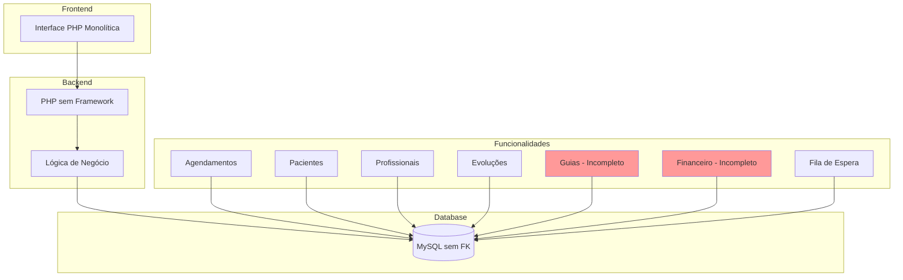
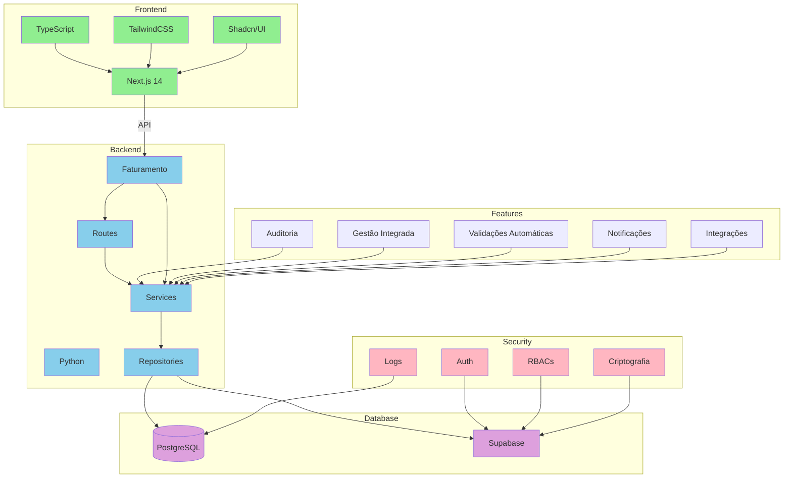

# Diagnóstico Técnico: Sistema ABA

## Sumário

Este documento apresenta uma análise técnica detalhada do sistema ABA atualmente utilizado pela clínica, identificando vulnerabilidades críticas em sua arquitetura, estrutura de banco de dados e seus impactos operacionais. Este documento se baseia única e exclusivamente na análise da estrutura do banco de dados e conversas informais, e pode conter erros de inferência sobre o sistema como um todo. O sistema ABA é vital para o funcionamento da clínica e irá necessitar de integração com o novo sistema de faturamento e auditoria em desenvolvimento.

## 1. Contexto do Sistema ABA

### 1.1. Responsabilidades Atuais do Sistema

- Gestão de agendamentos de terapias
- Cadastro e acompanhamento de pacientes
- Registro de evoluções dos pacientes
- Controle de profissionais e suas agendas
- Gestão de salas e recursos
- Histórico completo dos atendimentos
- Gestão de Relatórios Médicos
- Gestão de Fontes Pagadoras e seus códigos
- Gestão de solicitação de alterações de horários (necessita melhorias)
- Gestão de fila de espera para pacientes novos (necessita melhorias)

### 1.2. Funcionalidades Incompletas ou Sem Uso

- Emissão de Guia para pacientes particulares
- Gestão e controle de guias (todas as fontes pagadoras)
- Vínculo da guia com cada atendimento
- Módulo Financeiro

## Análise Crítica do Sistema Atual: Diagnóstico e Riscos

O estado atual do sistema apresenta alguns desafios importantes que precisam ser endereçados. Podemos fazer uma analogia com uma casa que precisa de reformas estruturais - existem aspectos que precisam ser fortalecidos para garantir maior segurança e eficiência.

### O Cenário Atual

A estrutura do banco de dados MySQL está operando sem algumas proteções importantes que sistemas modernos de gestão clínica costumam ter. É como manter registros importantes em um arquivo sem backup adequado - existe um risco significativo que precisa ser mitigado.

### Riscos e Suas Implicações

Quando falamos de dados sensíveis de crianças em acompanhamento terapêutico, precisamos ter cuidados especiais. O sistema atual pode permitir que informações importantes sejam modificadas sem registro adequado. Por exemplo, registros de evolução de uma criança poderiam ser alterados sem manter um histórico das mudanças.

As questões identificadas podem ter implicações importantes do ponto de vista regulatório, especialmente considerando a LGPD (Lei Geral de Proteção de Dados). É importante adequar o sistema para garantir maior conformidade com as normas vigentes.

## Situações do Dia a Dia

Na rotina da clínica, algumas situações merecem atenção:

O agendamento de sessões pode apresentar lentidão em determinados momentos, pois o sistema precisa processar muitas informações de forma não otimizada
Quando há mudanças na equipe, o sistema não atualiza automaticamente os agendamentos futuros, o que pode causar inconvenientes na gestão das sessões
Aspectos Financeiros
Do ponto de vista financeiro, existem oportunidades de melhoria. A falta de integração automática entre os registros de atendimentos realizados e o faturamento pode resultar em inconsistências. É importante garantir que todo atendimento seja adequadamente registrado para faturamento.

## Proteção de Dados

Um ponto importante é a segurança dos dados. O sistema atual possui oportunidades de melhoria no controle de acesso às informações dos pacientes. A implementação de um sistema de registro de acessos e alterações ajudaria a garantir maior proteção às informações.

É especialmente importante considerar que estamos lidando com informações sobre o desenvolvimento de crianças em acompanhamento terapêutico. Cada registro representa uma parte importante da história do desenvolvimento de uma criança, e precisamos garantir que essas informações sejam adequadamente preservadas e protegidas.

## 2. Vulnerabilidades Críticas

### 2.1. Ausência de Integridade Referencial

O sistema atual opera sem implementação de chaves estrangeiras (foreign keys) no banco de dados MySQL, comprometendo fundamentalmente a integridade dos dados. Esta deficiência estrutural resulta em:

1. **Fragmentação de Dados Clínicos**

   - Registros de pacientes podem ser removidos sem o adequado tratamento de seus históricos associados
   - Perda de relacionamento entre dados cadastrais e históricos de atendimento
   - Possibilidade de registros órfãos de evolução clínica
   - Risco de perda de histórico completo do paciente
2. **Inconsistência de Agendamentos**

   - Possibilidade de agendamentos para profissionais ou pacientes inexistentes no sistema
   - Registros de atendimentos sem vinculação correta
   - Dados duplicados em múltiplas tabelas
   - Impossibilidade de garantir consistência nas alterações
3. **Manutenção Complexa**

   - Necessidade de verificações manuais constantes
   - Procedimentos de limpeza de dados arriscados
   - Risco de perda permanente de dados críticos
   - Operações de exclusão sem validações adequadas
4. **Falhas no Controle de Guias e Fontes Pagadoras**

   - Ausência de relacionamento entre guias e atendimentos
   - Falta de controle de códigos de procedimentos por fonte pagadora
   - Risco de perda de faturamento por desvinculação
   - Impossibilidade de rastreamento efetivo de guias
5. **Problemas com Gestão de Fila e Alterações**

   - Falta de histórico de alterações de horários
   - Perda de rastreabilidade na fila de espera
   - Ausência de priorização automatizada
   - Risco de perda de solicitações

### 2.2. Deficiências de Performance

A ausência de índices adequados e a estrutura não normalizada do banco de dados resulta em:

1. **Problemas de Resposta**

   - Tempo de resposta inadequado para consultas básicas
   - Lentidão em buscas de pacientes
   - Atrasos na verificação de agendamentos
   - Sobrecarga em consultas complexas
2. **Sobrecarga de Recursos**

   - Uso excessivo de processamento
   - Necessidade de varredura completa das tabelas
   - Consumo desnecessário de memória
   - Degradação do servidor em horários de pico
3. **Degradação Progressiva**

   - Performance piora com aumento do volume de dados
   - Backups cada vez mais lentos
   - Consultas complexas tornam-se inviáveis
   - Tempo de resposta crescente

### 2.3. Ausência de Mecanismos de Automação e Validação

O sistema carece de estruturas fundamentais de banco de dados:

1. **Validações Ausentes**

   - Sem validação automática de dados cadastrais
   - Ausência de verificação de conflitos de horário
   - Falta de validação de requisitos de agendamento
   - Sem verificação de limites de sessões
2. **Automações Inexistentes**

   - Ausência de triggers e procedures
   - Sem validações no nível do banco
   - Falta de constraints adequadas
   - Ausência de registro automático de alterações
3. **Processos Críticos sem Automatização**

   - Emissão e controle de guias manual
   - Falta de integração com fontes pagadoras
   - Ausência de workflow para alterações de horário
   - Gestão manual da fila de espera

### 2.4. Vulnerabilidades de Segurança

A falta de políticas de controle de acesso expõe o sistema a riscos significativos:

1. **Controle de Acesso Inadequado**

   - Acesso irrestrito a dados sensíveis
   - Ausência de registro de acessos
   - Sem controle de modificações
   - Falta de trilha de auditoria
2. **Riscos de Segurança**

   - Vulnerabilidade a SQL injection
   - Sem criptografia adequada
   - Ausência de logs de auditoria
   - Sem controle de versão do código

### 2.5. Sobrecarga da Camada de Aplicação

A ausência de recursos nativos do banco de dados resulta em:

1. **Dependência do Código PHP**

   - Validações excessivas na camada de aplicação
   - Lógica de negócio misturada com apresentação
   - Alta complexidade de manutenção
   - Código duplicado em múltiplos lugares
2. **Problemas de Confiabilidade**

   - Maior probabilidade de falhas
   - Duplicação de regras de negócio
   - Inconsistência nas validações
   - Dificuldade de manutenção

## 3. Desafios de Integração com Novo Sistema (Auditoria de faturamento)

### 3.1. Sincronização de Dados

1. **Identificação Única de Registros**

   - Ausência de chaves únicas confiáveis
   - Possibilidade de duplicidade de registros
   - Diferentes formatos de dados cadastrais
   - Necessidade de processo de reconciliação
2. **Consistência entre Sistemas**

   - Dificuldade em relacionar agendamentos com faturamento
   - Ausência de status padronizados
   - Falta de registro de alterações
   - Necessidade de validação cruzada
3. **Complexidade dos Dados Financeiros**

   - Falta de padronização nos registros financeiros
   - Ausência de integração com guias
   - Diferentes formatos por fonte pagadora
   - Necessidade de reconciliação financeira

### 3.2. Desafios Técnicos

1. **Acesso aos Dados**

   - Necessidade de acesso direto ao MySQL
   - Ausência de APIs de integração
   - Risco de sobrecarga do banco
   - Necessidade de cache intermediário
2. **Transformação de Dados**

   - Diferentes formatos de data/hora
   - Inconsistência em padrões de texto
   - Campos não normalizados
   - Necessidade de mapeamento complexo

### 3.3. Estratégia de Integração

1. **Abordagem Recomendada**

   - Desenvolvimento de camada de abstração
   - Implementação de cache distribuído
   - Sistema de logs dedicado
   - Mecanismos de validação cruzada
2. **Priorização**

   - Sincronização de cadastros básicos
   - Validação de agendamentos
   - Conferência de execuções
   - Reconciliação periódica
3. **Processos Críticos**

   - Migração do controle de guias
   - Integração com fontes pagadoras
   - Unificação do processo financeiro
   - Automatização da fila de espera

## 4. Recomendações

### 4.1. Curto Prazo

1. Criar índices essenciais
2. Implementar logs básicos
3. Documentar estruturas críticas
4. Estabelecer backups consistentes
5. Estruturar controle de guias
6. Melhorar gestão da fila de espera

### 4.2. Médio Prazo

1. Desenvolver APIs de integração
2. Implementar validações críticas
3. Estabelecer controles de acesso
4. Criar documentação técnica

## 5. Comparativo com o Novo Sistema (Auditoria de faturamento)

### 5.1. Estrutura e Arquitetura

#### Sistema ABA (Atual)

- PHP monolítico sem framework
- Sem separação de responsabilidades
- Código fonte sem versionamento
- Ausência de documentação técnica

#### Novo Sistema (Em Desenvolvimento)

1. **Arquitetura Moderna**

   - Backend em FastAPI (Python) com arquitetura REST
   - Frontend em Next.js 14 com separação clara de responsabilidades
   - Documentação automática via OpenAPI/Swagger
   - Versionamento completo via Git
   - Padrão de projeto Repository Pattern
   - Separação clara entre camadas (routes, services, repositories)
2. **Tecnologias de Ponta**

   - TypeScript para tipagem estática no frontend
   - Python com type hints no backend
   - TailwindCSS para UI consistente
   - Shadcn/UI para componentes reutilizáveis

### 5.2. Integridade dos Dados

#### Sistema ABA (Atual)

- Sem chaves estrangeiras
- Risco de dados órfãos
- Sem integridade referencial
- Dados inconsistentes

#### Novo Sistema (Em Desenvolvimento)

1. **Banco de Dados Estruturado**

   - PostgreSQL com suporte completo a chaves estrangeiras
   - Relacionamentos definidos e validados
   - Constraints de integridade
   - Triggers para manutenção da consistência
2. **Validações em Múltiplas Camadas**

   - Schemas Pydantic para validação de dados
   - Validações no nível do banco de dados
   - Verificações de integridade referencial
   - Proteção contra deleção em cascata não controlada

### 5.3. Performance e Escalabilidade

#### Sistema ABA (Atual)

- Sem índices otimizados
- Queries não otimizadas
- Performance degradada com volume
- Sem cache

#### Novo Sistema (Em Desenvolvimento)

1. **Otimização de Banco**

   - Índices planejados e otimizados
   - Queries eficientes via ORM
   - Paginação em todas as listagens
   - Estratégia de cache implementada
2. **Arquitetura Escalável**

   - Serviços stateless
   - Cache distribuído
   - Processamento assíncrono
   - Load balancing via Vercel/Replit

### 5.4. Automação e Validação

#### Sistema ABA (Atual)

- Sem validações automáticas
- Processos manuais
- Sem trilha de auditoria
- Sem verificações automáticas

#### Novo Sistema (Em Desenvolvimento)

1. **Validações Automáticas**

   - Validação de dados em tempo real
   - Verificação automática de conflitos
   - Sistema de auditoria automatizado
   - Detecção proativa de divergências
2. **Processos Automatizados**

   - Workflow automatizado de faturamento
   - Verificação automática de execuções
   - Reconciliação automática de dados
   - Geração automatizada de relatórios

### 5.5. Segurança

#### Sistema ABA (Atual)

- Sem controle de acesso granular
- Vulnerável a SQL injection
- Sem registro de atividades
- Sem criptografia adequada

#### Novo Sistema (Em Desenvolvimento)

1. **Controle de Acesso**

   - Autenticação via Supabase Auth
   - Controle granular de permissões
   - Registro detalhado de atividades
   - Políticas de segurança por tabela
2. **Proteção de Dados**

   - Queries parametrizadas
   - Criptografia em repouso
   - HTTPS em todas as comunicações
   - Sanitização de inputs

### 5.6. Integração e Interoperabilidade

#### Sistema ABA (Atual)

- Sem APIs
- Acesso direto ao banco
- Sem padronização de dados
- Dificuldade de integração

#### Novo Sistema (Em Desenvolvimento)

1. **APIs RESTful**

   - Endpoints documentados
   - Versionamento de API
   - Padrões de resposta consistentes
   - Rate limiting implementado
2. **Camada de Integração**

   - Abstrações para sistemas externos
   - Transformadores de dados
   - Logs de integração
   - Mecanismos de retry

### 5.7. Monitoramento e Manutenção

#### Sistema ABA (Atual)

- Sem logs adequados
- Dificuldade em diagnosticar problemas
- Sem métricas de performance
- Manutenção complexa

#### Novo Sistema (Em Desenvolvimento)

1. **Sistema de Logs**

   - Logs estruturados
   - Rastreamento de erros
   - Métricas de performance
   - Alertas automáticos
2. **Facilidade de Manutenção**

   - Código modular
   - Testes automatizados
   - Documentação atualizada
   - Deploy automatizado

### 5.8. Gestão Financeira e Faturamento

#### Sistema ABA (Atual)

- Módulo financeiro incompleto
- Falta de integração com guias
- Processo manual de faturamento
- Sem rastreabilidade financeira
- Controle manual de códigos por fonte pagadora
- Falta de validação automática de guias
- Sem integração com sistemas das fontes pagadoras

#### Novo Sistema (Em Desenvolvimento)

1. **Gestão Integrada de Guias**

   - Vínculo automático entre guias e atendimentos
   - Validação automática de limites e autorizações
   - Controle de validade e saldos
   - Integração com fontes pagadoras via APIs
2. **Controle Financeiro**

   - Rastreamento completo de transações
   - Conciliação automática
   - Dashboard financeiro em tempo real
   - Relatórios automatizados por fonte pagadora
3. **Automação de Processos**

   - Fila de espera inteligente com priorização
   - Workflow automatizado para alterações de horários
   - Sistema de notificações para pacientes e profissionais
   - Controle de disponibilidade em tempo real

# Diagramas Comparativos: Sistema ABA vs Novo Sistema

## Sistema ABA (Atual)

## Novo Sistema (Em Desenvolvimento)

## Conclusão

O sistema ABA, apesar de suas limitações técnicas significativas, é fundamental para a operação da clínica. A integração com o novo sistema de faturamento e auditoria deve ser cuidadosamente planejada, considerando todas as vulnerabilidades identificadas e estabelecendo mecanismos robustos de validação e controle para garantir a integridade dos dados e a continuidade das operações.
