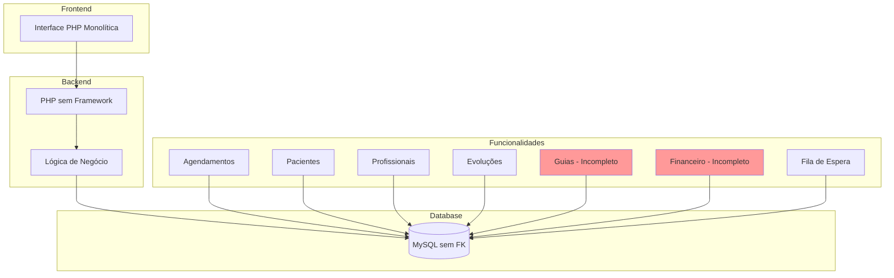
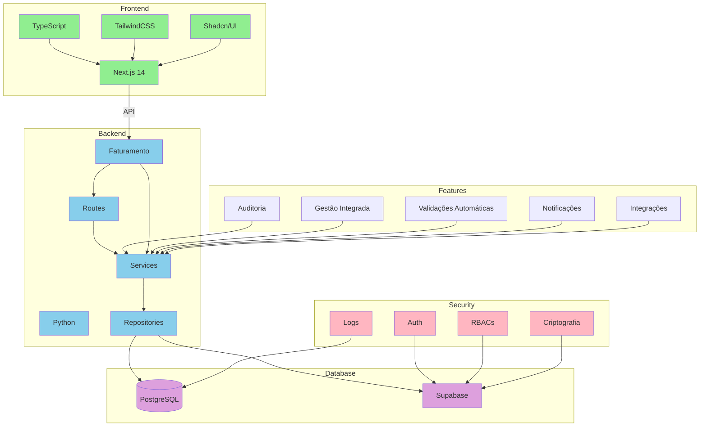

# Diagramas Comparativos: Sistema ABA vs Novo Sistema

## Sistema ABA (Atual)

```mermaid
graph TD
    subgraph Frontend
    UI[Interface PHP Monolítica]
    end

    subgraph Backend
    PHP[PHP sem Framework]
    BL[Lógica de Negócio]
    end

    subgraph Database
    MySQL[(MySQL sem FK)]
    end

    subgraph Funcionalidades
    AG[Agendamentos]
    PC[Pacientes]
    PR[Profissionais]
    EV[Evoluções]
    GU[Guias - Incompleto]
    FI[Financeiro - Incompleto]
    FE[Fila de Espera]
    end

    UI --> PHP
    PHP --> BL
    BL --> MySQL
    
    AG --> MySQL
    PC --> MySQL
    PR --> MySQL
    EV --> MySQL
    GU --> MySQL
    FI --> MySQL
    FE --> MySQL

    classDef incomplete fill:#ff9999
    class GU,FI incomplete
```

## Novo Sistema (Em Desenvolvimento)

```mermaid
graph TD
    subgraph Frontend
    NEXT[Next.js 14]
    TS[TypeScript]
    TC[TailwindCSS]
    SC[Shadcn/UI]
    end

    subgraph Backend
    FA[FastAPI]
    PY[Python]
    RT[Routes]
    SV[Services]
    RP[Repositories]
    end

    subgraph Database
    PG[(PostgreSQL)]
    SB[Supabase]
    end

    subgraph Features
    AU[Auditoria]
    FA[Faturamento]
    GI[Gestão Integrada]
    VA[Validações Automáticas]
    NT[Notificações]
    IN[Integrações]
    end

    subgraph Security
    AT[Auth]
    RB[RBACs]
    LG[Logs]
    CR[Criptografia]
    end

    NEXT --> |API| FA
    TS --> NEXT
    TC --> NEXT
    SC --> NEXT

    FA --> RT
    RT --> SV
    SV --> RP
    RP --> PG
    RP --> SB

    AU --> SV
    FA --> SV
    GI --> SV
    VA --> SV
    NT --> SV
    IN --> SV

    AT --> SB
    RB --> SB
    LG --> PG
    CR --> SB

    classDef frontend fill:#90EE90
    classDef backend fill:#87CEEB
    classDef database fill:#DDA0DD
    classDef security fill:#FFB6C1

    class NEXT,TS,TC,SC frontend
    class FA,PY,RT,SV,RP backend
    class PG,SB database
    class AT,RB,LG,CR security
```