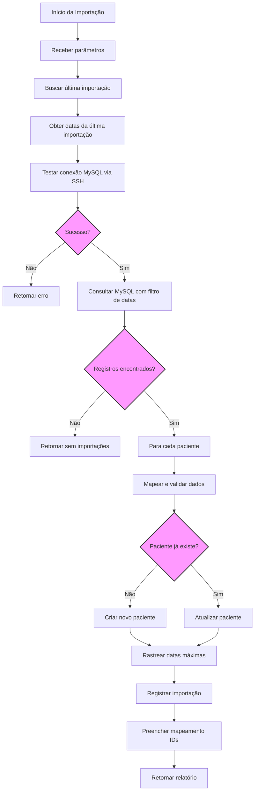

## Introdução

Este documento descreve o processo de importação de pacientes de um banco de dados MySQL legado para o novo sistema baseado em Supabase. A funcionalidade permite migrar dados de pacientes de forma controlada, com validações e tratamentos de erro adequados.

## Visão Geral do Processo

O sistema oferece um endpoint para importação de pacientes do MySQL para o Supabase, com as seguintes características:

1. **Conexão via SSH Tunnel**: A conexão com o banco MySQL é feita através de um túnel SSH para maior segurança
2. **Mapeamento de Campos**: Os campos do MySQL são mapeados para o esquema do Supabase
3. **Validação de Dados**: Os dados são validados antes da inserção no Supabase
4. **Tratamento de Erros**: Erros são registrados e reportados de forma estruturada
5. **Controle de Usuário**: Os registros são criados com informações do usuário que realizou a importação
6. **Atualização Inteligente**: Verifica a existência prévia do paciente e atualiza os dados em vez de tentar criar um novo registro duplicado
7. **Importação Incremental**: Apenas novos registros ou atualizações são importados, utilizando controle de datas

## Requisitos

- Acesso ao banco de dados MySQL via SSH
- Acesso ao Supabase
- Credenciais de usuário válidas no sistema

## Configuração

### Variáveis de Ambiente Necessárias

As seguintes variáveis devem estar configuradas no arquivo `.env`:

```
SUPABASE_URL=https://seuprojetosupabase.supabase.co
SUPABASE_KEY=sua-chave-secreta-supabase

MYSQL_HOST=127.0.0.1  # Será substituído pelo túnel SSH
MYSQL_PORT=3306
MYSQL_USER=seu_usuario_mysql
MYSQL_PASSWORD=sua_senha_mysql

SSH_HOST=endereco.do.servidor.ssh
SSH_PORT=22
SSH_USER=seu_usuario_ssh
SSH_PASSWORD=sua_senha_ssh
```

## Uso da API

### Endpoint de Importação

```
POST /api/pacientes/importar
```

### Parâmetros

O corpo da requisição deve ser um objeto JSON com os seguintes campos:

```json
{
  "database": "nome_do_banco_mysql",  // Obrigatório: nome do banco de dados MySQL
  "tabela": "nome_da_tabela",         // Obrigatório: nome da tabela de pacientes no MySQL
  "limit": 10,                        // Opcional: número máximo de registros a importar
  "usuario_id": "uuid-do-usuario"     // Opcional: ID do usuário executando a importação
}
```

Se `usuario_id` não for fornecido, o sistema usará "sistema" como valor padrão, que será convertido para um UUID fixo e existe (ou será criado) na tabela de usuários.

### Resposta

A resposta da API segue o formato:

```json
{
  "success": true,
  "message": "Importação concluída. X pacientes importados, Y atualizados com sucesso.",
  "importados": 190,
  "total": 200,
  "total_atualizados": 10,
  "total_erros": 0,
  "erros": [
    {
      "paciente": "Nome do Paciente",
      "erro": "Descrição do erro que ocorreu"
    }
  ],
  "connection_status": {
    "success": true,
    "message": "Conexão estabelecida com sucesso!"
  }
}
```

O campo `total_atualizados` indica quantos pacientes já existiam no banco e foram atualizados, em vez de criados como novos.

## Estrutura do Banco de Dados

### Campos na tabela `pacientes`

Para facilitar o rastreamento de pacientes importados e permitir atualizações incrementais, foram adicionados os seguintes campos:

| Campo | Tipo | Descrição |
|-------|------|-----------|
| importado | boolean | Indica se o paciente foi importado do MySQL |
| id_origem | string | ID original do paciente no MySQL |
| data_registro_origem | timestamp | Data de registro no sistema original |
| data_atualizacao_origem | timestamp | Data de atualização no sistema original |

### Tabela `controle_importacao_pacientes`

Esta tabela registra cada processo de importação:

| Campo | Tipo | Descrição |
|-------|------|-----------|
| id | uuid | Identificador único da importação |
| timestamp_importacao | timestamp | Data e hora da importação |
| ultima_data_registro_importada | timestamp | Data de registro mais recente importada |
| ultima_data_atualizacao_importada | timestamp | Data de atualização mais recente importada |
| quantidade_registros_importados | integer | Número de pacientes novos importados |
| quantidade_registros_atualizados | integer | Número de pacientes atualizados |
| usuario_id | uuid | ID do usuário que realizou a importação |
| observacoes | text | Observações sobre a importação |

## Mapeamento de Campos

A tabela abaixo mostra como os campos do MySQL são mapeados para o Supabase:

| Campo Supabase | Campo MySQL | Observações |
|----------------|-------------|-------------|
| id | gerado | UUID gerado automaticamente |
| nome | client_nome | |
| codigo_aba | client_id | Convertido para string |
| cpf | client_cpf | |
| rg | client_rg | |
| data_nascimento | client_data_nascimento | Convertido para ISO string |
| foto | client_thumb | URL da foto, se disponível |
| nome_responsavel | client_nome_responsavel | |
| nome_pai | client_nome_pai | |
| nome_mae | client_nome_mae | |
| sexo | client_sexo | Limitado a 1 caractere (primeira letra) |
| cep | client_cep | |
| endereco | client_endereco | |
| numero | client_numero | Convertido para inteiro |
| complemento | client_complemento | |
| bairro | client_bairro | |
| cidade | client_cidade_nome | |
| estado | client_state | Limitado a 2 caracteres e convertido para maiúsculo |
| forma_pagamento | client_payment | Convertido para inteiro |
| valor_consulta | consult_value | Convertido para decimal |
| patologia_id | client_patalogia_id | Convertido para inteiro |
| tem_supervisor | client_tem_supervisor | Convertido para booleano |
| supervisor_id | client_supervisor_id | Validado como UUID ou convertido para NULL |
| tem_avaliacao_luria | client_tem_avaliacao_luria | Convertido para booleano |
| created_by | usuario_id | ID do usuário que executou a importação |
| updated_by | usuario_id | ID do usuário que executou a importação |
| importado | true | Fixo para registros importados |
| id_origem | client_id | ID original no MySQL |
| data_registro_origem | client_registration_date | Data de registro no MySQL |
| data_atualizacao_origem | client_update_date | Data de atualização no MySQL |

## Tratamento Especial de Dados

### Serialização de Datas

Para evitar erros comuns ao trabalhar com datas, o sistema implementa múltiplas camadas de tratamento:

1. **Conversão Inicial**: Na função `mapear_paciente`, usamos `converter_data()` para transformar objetos `datetime` em strings ISO:
   ```python
   def converter_data(valor):
       if valor is None:
           return None
       if isinstance(valor, (datetime.date, datetime.datetime)):
           return valor.isoformat()
       return valor
   ```

2. **Serialização Global**: Após o mapeamento, aplicamos `DateEncoder` para garantir que todas as datas estejam serializadas:
   ```python
   paciente_dict = json.loads(json.dumps(paciente_dict, cls=DateEncoder))
   ```

3. **Formatação no Repositório**: Antes de enviar para o banco, usamos `format_date_fields` para garantir a consistência:
   ```python
   formatted_data = format_date_fields(data, DATE_FIELDS)
   ```

### Validação de UUIDs

Para campos que exigem UUIDs válidos (como `supervisor_id`), o sistema implementa validação específica:

```python
def eh_uuid_valido(valor):
    if valor is None:
        return False
    try:
        UUID(str(valor))
        return True
    except (ValueError, TypeError, AttributeError):
        return False
```

Os valores que não são UUIDs válidos (como "999") são automaticamente convertidos para `NULL` antes de serem enviados ao banco de dados.

### Tratamento de Tipos

O sistema inclui funções robustas para converter tipos de dados:

1. **Booleanos**: Aceita diversos formatos (0/1, true/false, sim/não)
2. **Inteiros**: Converte strings numéricas para inteiros
3. **Decimais**: Trata separadores de decimal diferentes (vírgula/ponto)
4. **Strings**: Garante que campos como `codigo_aba` sejam sempre string

## Criação Automática de Carteirinhas

Quando um paciente é importado com sucesso, o sistema verifica se ele possui um número de carteirinha e, caso positivo, cria automaticamente uma carteirinha no sistema:

1. **Verificação do Número**: Verifica se o campo `numero_carteirinha` está preenchido no registro do paciente
2. **Busca do Plano Unimed**: Busca o plano de saúde Unimed no sistema uma única vez no início da importação (otimização de performance)
3. **Verificação de Duplicidade**: Verifica se o paciente já possui uma carteirinha com o mesmo número para o plano Unimed
4. **Criação da Carteirinha**: Se não existir, cria uma nova carteirinha vinculando o paciente ao plano Unimed

### Otimização de Performance

Para garantir eficiência em importações com grandes volumes de dados, o sistema implementa a seguinte otimização:

```python
# Consultar o ID do plano Unimed uma única vez antes de iniciar a importação
plano_unimed_id = None
try:
    # Buscar especificamente o plano Unimed, já que é o único importado atualmente
    plano_saude_result = db.from_("planos_saude").select("id").ilike("nome", "%unimed%").is_("deleted_at", "null").execute()
    
    if plano_saude_result.data and len(plano_saude_result.data) > 0:
        plano_unimed_id = plano_saude_result.data[0]["id"]
        logger.info(f"Plano Unimed encontrado, ID: {plano_unimed_id}")
    else:
        logger.error("Plano Unimed não encontrado. Abortando importação de pacientes.")
        return {
            "success": False,
            "message": "Plano Unimed não encontrado. A importação foi abortada pois os pacientes precisam ser vinculados a este plano.",
            # Restante do código de resposta...
        }
except Exception as e:
    logger.error(f"Erro ao buscar plano Unimed: {str(e)}")
    return {
        "success": False,
        "message": f"Erro ao buscar plano Unimed: {str(e)}. A importação foi abortada.",
        # Restante do código de resposta...
    }
```

### Pré-requisitos de Importação

A importação de pacientes possui os seguintes pré-requisitos obrigatórios:

1. **Plano Unimed Cadastrado**: É necessário que exista pelo menos um plano de saúde com o nome contendo "Unimed" cadastrado no sistema. Caso contrário, a importação será **completamente abortada**. Essa verificação ocorre no início do processo para evitar importar pacientes sem a possibilidade de vincular suas carteirinhas.

2. **Conexão MySQL Funcional**: Uma conexão válida com o banco de dados MySQL de origem.

3. **Permissões de Usuário**: O usuário executando a importação deve ter permissões para criar registros no Supabase.

Dentro do loop de processamento de pacientes, o sistema utiliza o ID do plano Unimed já armazenado:

```python
# Verificar se o paciente tem número de carteirinha e criar uma carteirinha automaticamente
numero_carteirinha = paciente_dict.get('numero_carteirinha')
if numero_carteirinha and numero_carteirinha.strip() and plano_unimed_id:
    try:
        # Verificar se o paciente já tem alguma carteirinha com este número
        carteirinhas_existentes = db.from_("carteirinhas").select("id,numero_carteirinha,plano_saude_id").eq("paciente_id", paciente_id).is_("deleted_at", "null").execute()
        
        # Criação da carteirinha se necessário...
```

Esta abordagem elimina consultas redundantes ao banco de dados, reduzindo significativamente o tempo de processamento em importações de grande volume.

### Considerações Importantes

1. **Carteirinhas Múltiplas**: O sistema reconhece que um paciente pode ter múltiplas carteirinhas de diferentes planos
2. **Plano Unimed**: A implementação busca especificamente o plano Unimed, pois é o único utilizado no processo de importação atual
3. **Segurança**: A criação da carteirinha é envolvida em um bloco try-except para não comprometer a importação principal
4. **Preservação de Relacionamentos**: Carteirinhas existentes nunca são alteradas, apenas novas são criadas quando necessário
5. **Integridade Referencial**: As carteirinhas criadas automaticamente respeitam as restrições da tabela `carteirinhas`

### Benefícios da Criação Automática

- **Redução de Trabalho Manual**: Elimina a necessidade de criar manualmente carteirinhas para pacientes importados
- **Consistência de Dados**: Garante que pacientes com número de carteirinha tenham o registro adequado no sistema
- **Integração Completa**: Facilita a vinculação de guias e a criação de autorizações após a importação
- **Preservação de Histórico**: Mantém o vínculo do paciente com seu plano original durante a migração

## Importação Incremental

O sistema implementa um mecanismo de importação incremental para maior eficiência:

1. **Consulta Filtrada por Data**: A consulta SQL filtra pacientes com base nas datas da última importação:
   ```sql
   SELECT * FROM ps_clients WHERE 
   (IFNULL(client_registration_date, '1900-01-01') > ? OR 
    IFNULL(client_update_date, '1900-01-01') > ?)
   ```

2. **Rastreamento de Datas**: Durante a importação, o sistema rastreia as datas máximas de registro e atualização
3. **Registro na Tabela de Controle**: Essas datas são salvas na tabela `controle_importacao_pacientes` para uso em futuras importações
4. **Estatísticas Detalhadas**: O sistema distingue entre novos registros e atualizações

## Fluxo de Execução Detalhado

1. A API recebe os parâmetros de conexão MySQL e o ID do usuário
2. Busca a última importação na tabela `controle_importacao_pacientes`
3. Consulta o MySQL filtrando por datas mais recentes que a última importação
4. Para cada paciente encontrado:
   - Mapeia os campos do MySQL para o formato do Supabase
   - Converte datas para formato ISO 
   - Valida UUIDs como `supervisor_id`
   - Verifica se o paciente já existe pelo `codigo_aba`
   - Se existir, atualiza o registro; se não, cria um novo
   - Registra o sucesso ou falha da operação
5. Atualiza a tabela de controle com as datas mais recentes processadas
6. Retorna um relatório completo da importação

## Diagrama de Fluxo do Processo de Importação



### Descrição dos passos do diagrama
1. **Receber parâmetros**: database, tabela, limit (opcional), usuario_id
2. **Buscar última importação**: Consulta a tabela de controle de importações
3. **Obter datas**: ultima_data_registro e ultima_data_atualizacao
4. **Testar conexão**: Estabelece túnel SSH com o MySQL
5. **Consulta filtrada**: Busca apenas registros com datas mais recentes que a última importação
6. **Processamento individual**: Para cada paciente, mapeia campos e verifica existência
7. **Criação ou atualização**: Insere novos registros ou atualiza existentes
8. **Rastreamento de datas**: Mantém as datas máximas para próxima importação
9. **Registro de controle**: Salva dados da importação atual para referência futura
10. **Mapeamento de IDs**: Atualiza tabela de relacionamento entre IDs MySQL e Supabase
11. **Relatório final**: Retorna estatísticas de importação (total, importados, atualizados, erros)

## Tratamento de Erros Comuns

### Serialização de Datas

Erros como "Object of type datetime is not JSON serializable" são evitados com múltiplas camadas de serialização:

1. Conversão direta na função `mapear_paciente`
2. Serialização explícita com `DateEncoder`
3. Uso de `format_date_fields` no repositório

### UUIDs Inválidos

Erros como "invalid input syntax for type uuid" são evitados validando campos como `supervisor_id`:

```python
supervisor_id = paciente_mysql.get('client_supervisor_id')
supervisor_id_final = None
if supervisor_id is not None:
    if eh_uuid_valido(supervisor_id):
        supervisor_id_final = str(supervisor_id)
```

### Outros Erros

- **Valores Nulos**: São tratados com valores padrão ou conversões seguras
- **Erros de Conexão**: São capturados e registrados de forma estruturada
- **Violações de Unicidade**: Evitados pela verificação prévia de existência

## Mapeamento de IDs para Integrações

Para facilitar a relação entre os IDs numéricos do MySQL e os UUIDs do Supabase, o sistema implementa uma estratégia de mapeamento automatizado.

### Tabela de Mapeamento

```sql
CREATE TABLE IF NOT EXISTS mapeamento_ids_pacientes (
  id_mysql INT NOT NULL,
  id_supabase UUID NOT NULL,
  PRIMARY KEY (id_mysql)
);

CREATE INDEX IF NOT EXISTS idx_mapeamento_pacientes_id_supabase 
ON mapeamento_ids_pacientes(id_supabase);
```

### Preenchimento Automático do Mapeamento

Após cada importação de pacientes bem-sucedida, o sistema preenche automaticamente a tabela de mapeamento:

```python
# Após importar pacientes com sucesso
try:
    # Importar aqui para evitar dependência circular
    from ..services.importacao_service import ImportacaoService
    importacao_service = ImportacaoService()
    
    # Preencher o mapeamento
    logger.info("Preenchendo tabela de mapeamento de pacientes...")
    sucesso, mensagem, total_mapeados = await importacao_service.repository.preencher_mapeamento_pacientes()
    
    if sucesso:
        logger.info(f"Mapeamento atualizado: {total_mapeados} pacientes mapeados")
    else:
        logger.warning(f"Aviso ao preencher mapeamento: {mensagem}")
except Exception as e:
    logger.error(f"Erro ao preencher mapeamento de pacientes: {str(e)}")
```

### Estratégia de Upsert

O preenchimento usa uma abordagem de upsert (update or insert) para evitar duplicidades e preservar o histórico:

1. Para cada paciente importado, verifica se o `id_origem` já existe na tabela de mapeamento
2. Se existir, atualiza o mapeamento para o UUID atual
3. Se não existir, insere um novo registro de mapeamento
4. Processa em lotes de 50 para melhor desempenho

### Endpoint para Preenchimento Manual

Existe também um endpoint dedicado para preencher o mapeamento manualmente:

```
GET /api/importacao/preencher-mapeamento-pacientes
```

Este endpoint pode ser acessado quando necessário para garantir que a tabela de mapeamento esteja atualizada, especialmente antes de importar agendamentos ou outros registros relacionados.

### Uso do Mapeamento em Outras Importações

Este mapeamento é essencial para a importação de entidades relacionadas como agendamentos, pois permite converter IDs numéricos do MySQL em UUIDs válidos do Supabase:

```python
# Exemplo de uso em mapear_agendamento()
if supabase_client and str(original_id).isdigit():
    id_mysql = int(original_id)
    
    # Buscar o UUID correspondente na tabela de mapeamento
    response = supabase_client.table("mapeamento_ids_pacientes") \
        .select("id_supabase") \
        .eq("id_mysql", id_mysql) \
        .execute()
    
    if response.data and len(response.data) > 0:
        paciente_id = response.data[0]["id_supabase"]
```

## Exemplo de Uso (Frontend)

```javascript
// Exemplo de como chamar a API a partir do frontend
const importarPacientes = async () => {
  try {
    const dados = {
      database: "nome_do_banco",
      tabela: "nome_da_tabela",
      limit: 50,
      usuario_id: usuarioAtual.id  // ID do usuário logado
    };

    const response = await fetch('/api/pacientes/importar', {
      method: 'POST',
      headers: {
        'Content-Type': 'application/json'
      },
      body: JSON.stringify(dados)
    });

    const resultado = await response.json();
    
    if (resultado.success) {
      console.log(`Importação concluída: ${resultado.importados} de ${resultado.total} pacientes importados`);
      if (resultado.total_atualizados > 0) {
        console.log(`${resultado.total_atualizados} pacientes foram atualizados porque já existiam`);
      }
    } else {
      console.error('Erro na importação:', resultado.message);
    }
    
    // Exibir erros específicos
    if (resultado.erros && resultado.erros.length > 0) {
      console.warn('Erros durante a importação:', resultado.erros);
    }
  } catch (error) {
    console.error('Erro ao chamar a API:', error);
  }
};
```

## Considerações de Implementação

### Repositório Padrão

O sistema utiliza o repositório padrão `paciente.py` (não o `paciente_repository.py`), seguindo o padrão de nomenclatura do projeto. Este repositório:

- Recebe uma conexão Supabase como parâmetro de inicialização
- Utiliza corretamente a formatação de datas com `format_date_fields`
- Possui métodos com nomes em inglês (`list`, `get_by_id`, `create`, `update`, `delete`)

### Boas Práticas para Manutenção

1. **Consistência no Tratamento de Datas**: Sempre use `format_date_fields` e serialização explícita
2. **Validação de UUIDs**: Use a função `eh_uuid_valido` para campos que exigem UUIDs
3. **Tratamento Defensivo**: Sempre verifique valores nulos e faça conversões seguras
4. **Logs Detalhados**: Mantenha os logs para depuração e análise de problemas

## Conclusão

A importação de pacientes do MySQL para o Supabase é um processo robusto que implementa várias camadas de validação e tratamento de erros. Com a importação incremental e o controle de datas, o sistema permite migrações eficientes e contínuas, mantendo a consistência dos dados entre sistemas.

Este documento aborda os aspectos mais importantes da implementação, desde a conexão com o MySQL até a inserção e atualização no Supabase, destacando o tratamento especial dado a datas, UUIDs e outros tipos de dados que exigem validação específica.

### Considerações Importantes

1. **Carteirinhas Múltiplas**: O sistema reconhece que um paciente pode ter múltiplas carteirinhas de diferentes planos
2. **Plano Unimed**: A implementação busca especificamente o plano Unimed, pois é o único utilizado no processo de importação atual
3. **Segurança**: A criação da carteirinha é envolvida em um bloco try-except para não comprometer a importação principal
4. **Preservação de Relacionamentos**: Carteirinhas existentes nunca são alteradas, apenas novas são criadas quando necessário
5. **Integridade Referencial**: As carteirinhas criadas automaticamente respeitam as restrições da tabela `carteirinhas`

### Benefícios da Criação Automática

- **Redução de Trabalho Manual**: Elimina a necessidade de criar manualmente carteirinhas para pacientes importados
- **Consistência de Dados**: Garante que pacientes com número de carteirinha tenham o registro adequado no sistema
- **Integração Completa**: Facilita a vinculação de guias e a criação de autorizações após a importação
- **Preservação de Histórico**: Mantém o vínculo do paciente com seu plano original durante a migração
