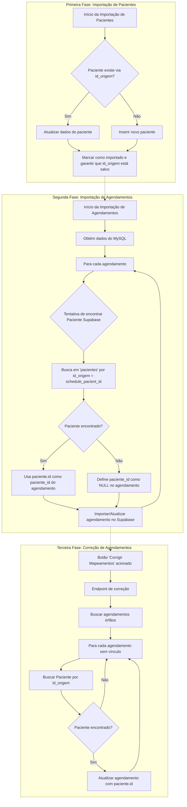

<think>Vou criar um diagrama detalhado do fluxo de mapeamento e importação de agendamentos, usando mermaid. Também vou atualizar a documentação com os principais pontos que precisam ser destacados para entender esse processo.

Para o diagrama Mermaid, vou criar um fluxograma que mostra:
1. O processo de importação de pacientes
2. A criação do mapeamento de IDs
3. A importação de agendamentos
4. A correção de agendamentos sem vínculos

Vou incluir os pontos de decisão importantes e as tabelas do banco de dados envolvidas.</think># Documentação Atualizada: Vinculação de Pacientes e Agendamentos (Relação Direta)

## Fluxo de Vinculação e Importação

O sistema utiliza uma **abordagem de relação direta** para vincular pacientes e agendamentos entre o sistema legado (MySQL) e o Supabase, usando o ID original do registro armazenado no campo `id_origem` da tabela de pacientes e o ID do paciente legado armazenado nos agendamentos. Não há mais necessidade de tabelas de mapeamento intermediárias. Abaixo está o diagrama atualizado do fluxo:

## Detalhamento do Processo

### 1. Importação de Pacientes
- Os pacientes são importados do MySQL para o Supabase.
- Cada paciente importado ou atualizado recebe a flag `importado = true`.
- O campo **`id_origem`** na tabela `pacientes` armazena o ID numérico original do paciente no MySQL. Este campo é crucial para a vinculação.

### 2. Importação de Agendamentos
- Ao importar agendamentos do MySQL, o sistema obtém o ID do paciente do sistema legado (campo como `schedule_pacient_id`).
- Para cada agendamento, o sistema tenta encontrar o paciente correspondente no Supabase:
    1. Busca na tabela `pacientes` por um registro onde `id_origem` seja igual ao `schedule_pacient_id` do agendamento.
- Se um paciente correspondente for encontrado no Supabase, o campo `paciente_id` do agendamento é preenchido com o `id` (UUID) desse paciente.
- Se **nenhuma correspondência** for encontrada (por exemplo, se o paciente ainda não foi importado), o campo `paciente_id` do agendamento fica como `NULL`.

### 3. Correção de Agendamentos (Processo Manual via Botão "Corrigir Mapeamentos")
- Esta funcionalidade é acionada pelo botão "Corrigir Mapeamentos" na interface de Agendamentos, que chama o endpoint `/api/importacao/corrigir-agendamentos-importados`.
- **Objetivo**: Vincular agendamentos que foram importados mas não puderam ser associados a um paciente no momento da importação (ou seja, têm `