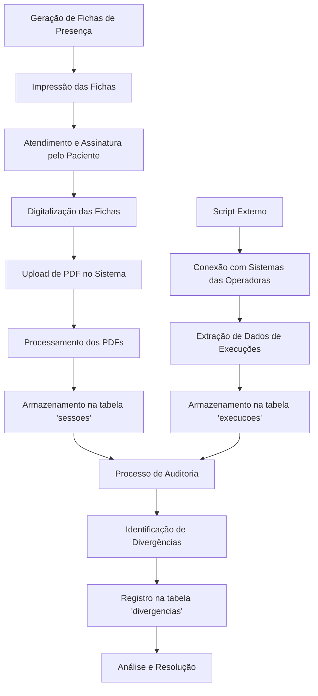
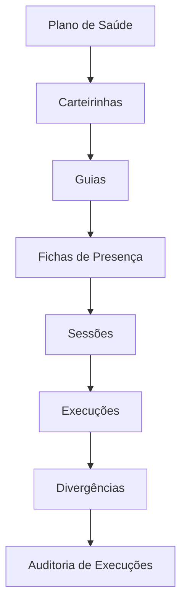

## Índice

0. [Estrutura do Projeto](#0-estrutura-do-projeto)
   1. [Visão Geral](#01-visão-geral)
   2. [Estrutura do Backend](#02-estrutura-do-backend)
   3. [Estrutura do Frontend](#03-estrutura-do-frontend)
   4. [Documentação e Instruções](#04-documentação-e-instruções)
1. [Estrutura do Banco de Dados](#1-estrutura-do-banco-de-dados)
   1. [Diagrama de Relacionamentos](#11-diagrama-de-relacionamentos)
   2. [Fluxo de Dados](#12-fluxo-de-dados)
2. [Sistema de Auditoria de Divergências](#2-sistema-de-auditoria-de-divergências)
   1. [Visão Geral](#21-visão-geral)
   2. [Tipos de Divergências](#22-tipos-de-divergências)
   3. [Processo de Auditoria](#23-processo-de-auditoria)
   4. [Registro de Divergências](#24-registro-de-divergências)
   5. [Acompanhamento e Resolução](#25-acompanhamento-e-resolução)
   6. [Relatórios e Estatísticas](#26-relatórios-e-estatísticas)
   7. [Interface de Usuário](#27-interface-de-usuário)
   8. [Boas Práticas](#28-boas-práticas)
   9. [Detalhamento das Verificações](#29-detalhamento-das-verificações)
   10. [Processo de Auditoria Detalhado](#210-processo-de-auditoria-detalhado)
   11. [Resolução de Divergências](#211-resolução-de-divergências)
   12. [Relatórios e Análises](#212-relatórios-e-análises)
   13. [Interface do Usuário Detalhada](#213-interface-do-usuário-detalhada)
   14. [Fluxos de Trabalho](#214-fluxos-de-trabalho)
   15. [Melhores Práticas](#215-melhores-práticas)
3. [Testes de Auditoria](#3-testes-de-auditoria)
   1. [Geração de Dados de Teste](#31-geração-de-dados-de-teste)
   2. [Cenários de Teste Implementados](#32-cenários-de-teste-implementados)
   3. [Configuração do Script](#33-configuração-do-script)
   4. [Fluxo de Teste de Auditoria](#34-fluxo-de-teste-de-auditoria)
   5. [Importante](#35-importante)
   6. [Plano de Testes Abrangente](#36-plano-de-testes-abrangente)
4. [Implementação Atual](#4-implementação-atual)
   1. [Arquitetura](#41-arquitetura)
   2. [Fluxo de Execução](#42-fluxo-de-execução)
   3. [Particularidades da Implementação](#43-particularidades-da-implementação)
   4. [Endpoints da API](#44-endpoints-da-api)
   5. [Interface com o Frontend](#45-interface-com-o-frontend)
   6. [Banco de Dados](#46-banco-de-dados)
5. [Recomendações para Melhorias](#5-recomendações-para-melhorias)
   1. [Vinculação entre Agendamentos e Fichas](#51-vinculação-entre-agendamentos-e-fichas)
   2. [Outras Melhorias Recomendadas](#52-outras-melhorias-recomendadas)
6. [Tabela de Atendimentos para Faturamento](#6-tabela-de-atendimentos-para-faturamento)
   1. [Estrutura da Tabela](#61-estrutura-da-tabela)
   2. [Descrição dos Campos](#62-descrição-dos-campos)
   3. [Processo de Preenchimento](#63-processo-de-preenchimento)
   4. [Exemplo de Consulta SQL para Preenchimento](#64-exemplo-de-consulta-sql-para-preenchimento)
   5. [Vantagens desta Abordagem](#65-vantagens-desta-abordagem)
   6. [Considerações de Implementação](#66-considerações-de-implementação)
   7. [Integração com o Sistema de Auditoria](#67-integração-com-o-sistema-de-auditoria)
7. [Fluxo de Processamento de Fichas de Presença](#7-fluxo-de-processamento-de-fichas-de-presença)
   1. [Visão Geral do Processo](#71-visão-geral-do-processo)
   2. [Captura de Execuções da Operadora](#72-captura-de-execuções-da-operadora)
   3. [Processo de Auditoria](#73-processo-de-auditoria)
   4. [Diagrama do Fluxo de Processamento](#74-diagrama-do-fluxo-de-processamento)
   5. [Funcionalidade de Upload de PDF](#75-funcionalidade-de-upload-de-pdf)
   6. [Integração com o Sistema de Faturamento](#76-integração-com-o-sistema-de-faturamento)
   7. [Considerações Importantes](#77-considerações-importantes)
8. [Script de Criação da Tabela de Atendimentos para Faturamento](#8-script-de-criação-da-tabela-de-atendimentos-para-faturamento)
   1. [Explicação do Script](#81-explicação-do-script)
   2. [Como Utilizar](#82-como-utilizar)
   3. [Considerações de Implementação](#83-considerações-de-implementação)
9. [Estrutura Detalhada das Tabelas do Sistema](#9-estrutura-detalhada-das-tabelas-do-sistema)
   1. [Hierarquia de Entidades](#91-hierarquia-de-entidades)
   2. [Descrição Detalhada das Tabelas](#92-descrição-detalhada-das-tabelas)
   3. [Campos Comuns em Todas as Tabelas](#93-campos-comuns-em-todas-as-tabelas)
   4. [Políticas de Segurança](#94-políticas-de-segurança)

## 0. Estrutura do Projeto

### 0.1 Visão Geral

O projeto está organizado da seguinte forma:

```
clinicalmf-producao/
├── frontend/           # Aplicação Next.js
├── backend/            # API FastAPI
│   ├── config/         # Configurações
│   ├── repositories/   # Acesso a dados
│   ├── services/       # Lógica de negócios
│   ├── scripts/        # Scripts utilitários
│   └── app.py          # Aplicação principal
├── docs/               # Documentação geral
├── instrucoes/         # Guias e instruções
├── sql/                # Scripts SQL
└── templates/          # Templates e modelos
```

Esta estrutura foi reorganizada para melhorar a separação de responsabilidades e facilitar a manutenção do código.

### 0.2 Estrutura do Backend

A estrutura do backend foi reorganizada para melhor separação de responsabilidades:

```
backend/
├── config/                 # Configurações do projeto
│   ├── __init__.py
│   └── config.py          # Configurações globais e cliente Supabase
├── repositories/          # Camada de acesso a dados
│   ├── __init__.py
│   ├── database_supabase.py
│   ├── auditoria_repository.py
│   └── ...
├── services/             # Lógica de negócios
│   ├── __init__.py
│   ├── auditoria_service.py
│   └── ...
├── scripts/              # Scripts utilitários
│   ├── __init__.py
│   ├── gerar_dados_antigo.py
│   ├── gerar_dados_teste.py
│   └── gerar_dados_de_testes.py
└── app.py               # Aplicação FastAPI principal
```

#### Configurações (`config/`)
- `config.py`: Configurações globais usando Pydantic Settings
- Gerencia conexão com Supabase e variáveis de ambiente
- Centraliza todas as configurações em um único local

#### Repositórios (`repositories/`)
- Camada de acesso a dados
- Implementa operações CRUD com o Supabase
- Separa lógica de banco de dados da lógica de negócios

#### Serviços (`services/`)
- Implementa a lógica de negócios
- Utiliza os repositórios para operações de dados
- Processa regras de negócio e validações

#### Scripts (`scripts/`)
- Scripts utilitários para testes e desenvolvimento
- Geração de dados de teste
- Ferramentas de manutenção

### 0.3 Estrutura do Frontend

```
frontend/
├── src/
│   ├── app/              # Páginas e rotas
│   ├── components/       # Componentes reutilizáveis
│   ├── hooks/           # Hooks personalizados
│   ├── services/        # Serviços e APIs
│   ├── styles/          # Estilos globais
│   └── utils/           # Utilitários
├── public/              # Arquivos estáticos
├── .env.example         # Exemplo de variáveis de ambiente
└── package.json         # Dependências e scripts
```

### 0.4 Documentação e Instruções

```
docs/
├── visao_geral.md            # Visão geral do sistema
├── scripts-sql.md            # Documentação SQL
├── database/                 # Documentação do Banco de Dados
│   ├── schema.md             # Diagrama de Relacionamentos
│   └── fluxo_dados.md        # Fluxo de Dados
├── sistema_auditoria/        # Documentação do Sistema de Auditoria
├── faturamento/             # Documentação da Tabela de Faturamento
├── fichas_processamento/    # Documentação do Fluxo de Fichas
└── melhorias_futuras.md     # Recomendações para Melhorias

instrucoes/
├── instrucoes_backend.md    # Guia do backend
├── instrucoes_frontend.md   # Guia do frontend
├── instrucoes_utils.md      # Guia de utilitários
├── instrucoes_testes.md     # Guia de testes
├── instrucoes_deploy.md     # Guia de deploy
└── instrucoes_sql.md        # Instruções SQL
```

## 1. Estrutura do Banco de Dados

### 1.1 Diagrama de Relacionamentos

```mermaid
erDiagram
    SISTEMA_ABA {
        string api_endpoint
        string credenciais
        string frequencia_sincronizacao
    }
    
    AGENDAMENTOS {
        uuid id PK
        varchar(20) schedule_pacient_id FK
        uuid schedule_especialidade_id FK
        uuid schedule_room_id
        text schedule_pagamento
        uuid schedule_parent_id FK
        uuid parent_id FK
        timestamptz schedule_date_start
        timestamptz schedule_date_end
        enum schedule_status
    }
    
    PACIENTES {
        uuid id PK
        string nome
        varchar(14) cpf
        varchar(20) codigo_aba UK
        date data_nascimento
        uuid profissional_id FK
        uuid supervisor_id FK
        text telefone
        text email
    }
    
    ESPECIALIDADES {
        uuid id PK
        string nome
        text anexo
        enum status
    }
    
    CARTEIRINHAS {
        uuid id PK
        uuid paciente_id FK
        uuid plano_saude_id FK
        string numero_carteirinha
        date data_validade
        enum status
    }
    
    GUIAS {
        uuid id PK
        uuid carteirinha_id FK
        uuid paciente_id FK
        uuid procedimento_id FK
        string numero_guia
        string numero_guia_operadora
        string senha_autorizacao
        date data_emissao
        date data_validade
        date data_autorizacao
        date data_validade_senha
        enum tipo
        enum status
        integer quantidade_autorizada
        integer quantidade_executada
        decimal valor_autorizado
        string profissional_solicitante
        string profissional_executante
        string origem
        string observacoes
    }
    
    PROCEDIMENTOS {
        uuid id PK
        string codigo UK
        string nome
        enum tipo
        decimal valor
        boolean ativo
    }
    
    FICHAS {
        uuid id PK
        string codigo_ficha
        uuid guia_id FK
        string numero_guia
        uuid agendamento_id FK
        uuid storage_id FK
        enum status
        date data_atendimento
    }
    
    SESSOES {
        uuid id PK
        uuid ficha_id FK
        uuid guia_id FK
        date data_sessao
        uuid procedimento_id FK
        enum status
        boolean possui_assinatura
        string numero_guia
        string codigo_ficha
        string profissional_executante
        string origem
        string ip_origem
        integer ordem_execucao
        enum status_biometria
    }
    
    EXECUCOES {
        uuid id PK
        uuid guia_id FK
        uuid sessao_id FK
        date data_execucao
        date data_atendimento
        string paciente_nome
        string paciente_carteirinha
        string numero_guia
        string codigo_ficha
        boolean codigo_ficha_temp
        uuid usuario_executante FK
        string origem
        string ip_origem
        integer ordem_execucao
        enum status_biometria
        string conselho_profissional
        string numero_conselho
        string uf_conselho
        string codigo_cbo
        string profissional_executante
    }
    
    ATENDIMENTOS_FATURAMENTO {
        uuid id PK
        uuid id_atendimento FK
        string carteirinha
        string paciente_nome
        date data_atendimento
        time hora_inicial
        uuid id_profissional FK
        string profissional_nome
        string status
        string codigo_faturamento
    }
    
    DIVERGENCIAS {
        uuid id PK
        string numero_guia
        enum tipo_divergencia
        string descricao
        string paciente_nome
        string codigo_ficha
        date data_execucao
        date data_atendimento
        string carteirinha
        string prioridade
        enum status
        timestamptz data_identificacao
        timestamptz data_resolucao
        uuid resolvido_por FK
        jsonb detalhes
        uuid ficha_id FK
        uuid execucao_id FK
        uuid sessao_id FK
        uuid paciente_id FK
        integer tentativas_resolucao
    }
    
    AUDITORIA_EXECUCOES {
        uuid id PK
        timestamptz data_execucao
        date data_inicial
        date data_final
        integer total_protocolos
        integer total_divergencias
        integer total_fichas
        integer total_guias
        integer total_execucoes
        integer total_resolvidas
        jsonb divergencias_por_tipo
        jsonb metricas_adicionais
        string status
    }
    
    USUARIOS {
        uuid id PK
        uuid auth_user_id UK
        string nome
        string email UK
        enum tipo_usuario
        boolean ativo
        timestamptz ultimo_acesso
        jsonb permissoes
        varchar(15) crm
        varchar(15) telefone
        text foto
    }
    
    PLANOS_SAUDE {
        uuid id PK
        string nome
        string codigo_operadora UK
        varchar(20) registro_ans
        boolean ativo
        jsonb dados_contrato
    }
    
    STORAGE {
        uuid id PK
        string nome
        string url
        string tipo_referencia
        integer size
        string content_type
    }
    
    USUARIOS_ESPECIALIDADES {
        uuid id PK
        uuid usuario_id FK
        uuid especialidade_id FK
        boolean principal
    }
    
    %% Relacionamentos existentes
    SISTEMA_ABA ||--o{ AGENDAMENTOS : "sincroniza"
    PACIENTES ||--o{ AGENDAMENTOS : "tem via codigo_aba"
    PACIENTES ||--o{ CARTEIRINHAS : "possui"
    ESPECIALIDADES ||--o{ AGENDAMENTOS : "associada a"
    AGENDAMENTOS ||--o{ AGENDAMENTOS : "parent_id/schedule_parent_id"
    
    CARTEIRINHAS ||--o{ GUIAS : "autoriza"
    PACIENTES ||--o{ GUIAS : "recebe"
    PROCEDIMENTOS ||--o{ GUIAS : "autoriza"
    
    GUIAS ||--o{ FICHAS : "gera"
    
    FICHAS ||--o{ SESSOES : "contém"
    GUIAS ||--o{ SESSOES : "autoriza"
    PROCEDIMENTOS ||--o{ SESSOES : "realizado em"
    
    GUIAS ||--o{ EXECUCOES : "registra"
    SESSOES ||--o{ EXECUCOES : "registra"
    
    USUARIOS ||--o{ PACIENTES : "supervisiona"
    PLANOS_SAUDE ||--o{ CARTEIRINHAS : "emite"
    
    %% Relacionamento tabela de fichas e agendamentos
    AGENDAMENTOS ||--o{ FICHAS : "gera após execução"
    
    %% Relacionamento com tabela de faturamento
    AGENDAMENTOS ||--o{ ATENDIMENTOS_FATURAMENTO : "gera quando realizado"
    USUARIOS ||--o{ ATENDIMENTOS_FATURAMENTO : "profissional executante"
    
    %% Relacionamento com storage
    STORAGE ||--o{ FICHAS : "armazena documentos"
    
    %% Tabela de divergências
    SESSOES ||--o{ DIVERGENCIAS : "pode gerar"
    EXECUCOES ||--o{ DIVERGENCIAS : "pode gerar"
    FICHAS ||--o{ DIVERGENCIAS : "relaciona"
    PACIENTES ||--o{ DIVERGENCIAS : "associado a"
    
    %% Relacionamentos do arquivo antigo
    USUARIOS ||--o{ USUARIOS_ESPECIALIDADES : "possui"
    ESPECIALIDADES ||--o{ USUARIOS_ESPECIALIDADES : "tem"
```



### 1.2 Fluxo de Dados

O fluxo principal de dados no sistema segue a seguinte sequência:

1. **Sincronização com Sistema ABA**: Os agendamentos são sincronizados a partir do sistema ABA, que controla toda a parte de agendamento e evolução dos pacientes. Esta sincronização ocorre via API ou diretamente no banco de dados.
2. Paciente possui carteirinha
3. Carteirinha permite criar guias para procedimentos
4. Agendamentos são criados para organizar quando os atendimentos ocorrerão
5. Quando o atendimento é executado, são geradas fichas
6. Fichas contêm sessões
7. Sessões são registradas como execuções
8. Agendamentos com status 'realizado' geram registros na tabela de atendimentos para faturamento

**Observação importante**: Atualmente, há uma vinculação direta entre o agendamento e a ficha através do campo `agendamento_id` na tabela de fichas. Esta relação permite rastrear a origem da ficha ao agendamento que a gerou.

## 2. Sistema de Auditoria de Divergências

### 2.1 Visão Geral

O sistema de auditoria é responsável por identificar e gerenciar divergências entre fichas físicas de atendimento e execuções registradas no sistema. O processo inclui:

1. Verificação automática de divergências
2. Registro e categorização de problemas
3. Acompanhamento e resolução
4. Geração de relatórios e estatísticas

### 2.2 Tipos de Divergências

#### 2.2.1 Categorias Principais
```python
tipos_divergencias = {
    "ficha_sem_execucao": "Ficha registrada sem execução correspondente",
    "execucao_sem_ficha": "Execução registrada sem ficha correspondente",
    "data_divergente": "Data da execução diferente da data da sessão",
    "sessao_sem_assinatura": "Sessão sem assinatura do paciente",
    "guia_vencida": "Guia com data de validade expirada",
    "quantidade_excedida": "Quantidade de execuções maior que autorizado",
    "falta_data_execucao": "Execução sem data registrada",
    "duplicidade": "Execução registrada em duplicidade"
}
```

#### 2.2.2 Prioridades
- ALTA: Divergências que impactam faturamento
- MEDIA: Divergências documentais ou procedimentais

### 2.3 Processo de Auditoria

#### 2.3.1 Execução da Auditoria
```python
async def realizar_auditoria_fichas_execucoes(
    data_inicial: str = None,
    data_final: str = None
):
    # 1. Busca fichas e execuções no período
    # 2. Verifica divergências
    # 3. Registra resultados
    # 4. Gera relatório
```

#### 2.3.2 Verificações Realizadas

1. **Datas**:
```python
def verificar_datas(protocolo: Dict, execucao: Dict) -> bool:
    """
    Verifica se as datas do protocolo e execução correspondem.
    
    Regras:
    1. Data da execução deve ser igual à data da sessão
    2. Data não pode ser futura
    3. Data deve estar dentro da validade da guia
    """
    data_protocolo = protocolo.get("data_atendimento")
    data_execucao = execucao.get("data_execucao")
    
    if not data_protocolo or not data_execucao:
        return False
        
    return data_protocolo == data_execucao
```

2. **Quantidades**:
```python
def verificar_quantidade_execucoes(protocolo: Dict, execucoes: List[Dict]) -> bool:
    """
    Verifica se a quantidade de execuções está dentro do limite.
    
    Regras:
    1. Não pode exceder quantidade autorizada na guia
    2. Não pode haver duplicidade no mesmo dia
    3. Deve respeitar intervalo mínimo entre sessões
    """
    quantidade_autorizada = protocolo.get("quantidade_autorizada", 0)
    quantidade_executada = len(execucoes)
    
    return quantidade_executada <= quantidade_autorizada
```

3. **Assinaturas**:
```python
def verificar_assinatura_ficha(ficha: Dict) -> bool:
    """
    Verifica se a ficha possui assinatura válida.
    
    Regras:
    1. Deve ter assinatura do paciente
    2. Assinatura deve ser legível
    3. Data da assinatura deve corresponder à data da sessão
    """
    return ficha.get("possui_assinatura", False)
```

4. **Duplicidade**:
```python
def verificar_duplicidade_execucoes(execucoes: List[Dict]) -> List[Dict]:
    """
    Identifica execuções duplicadas.
    
    Regras:
    1. Mesma data
    2. Mesmo procedimento
    3. Mesmo paciente
    4. Mesma guia
    """
    duplicadas = []
    execucoes_por_data = {}
    
    for execucao in execucoes:
        data = execucao.get("data_execucao")
        if data in execucoes_por_data:
            duplicadas.append(execucao)
        else:
            execucoes_por_data[data] = execucao
            
    return duplicadas
```

### 2.4 Registro de Divergências

#### 2.4.1 Estrutura da Divergência
```typescript
interface Divergencia {
    id: string;
    tipo: string;  // campo padrão para o tipo de divergência
    tipo_divergencia?: string;  // mantido para compatibilidade com código legado
    descricao: string;
    paciente_nome: string;
    codigo_ficha?: string;
    data_execucao?: string;
    data_atendimento?: string;
    carteirinha?: string;
    prioridade: "ALTA" | "MEDIA" | "BAIXA";
    status: "pendente" | "em_analise" | "resolvida" | "ignorada";
    detalhes?: any;
    ficha_id?: string;
    execucao_id?: string;
    sessao_id?: string;
    paciente_id?: string;
    data_identificacao: string;
    data_resolucao?: string;
    resolvido_por?: string;
    tentativas_resolucao: number;
    created_at: string;
    updated_at: string;
    created_by?: string;
    updated_by?: string;
    deleted_at?: string;
}
```

#### 2.4.2 Registro de Nova Divergência
```python
def registrar_divergencia_detalhada(divergencia: Dict) -> bool:
    # 1. Valida dados
    # 2. Formata informações
    # 3. Registra no banco
    # 4. Atualiza estatísticas
```

### 2.5 Acompanhamento e Resolução

#### 2.5.1 Status de Divergências
- pendente: Aguardando análise
- em_analise: Em processo de verificação
- resolvida: Divergência solucionada
- cancelada: Divergência ignorada ou invalidada

#### 2.5.2 Atualização de Status
```python
def atualizar_status_divergencia(
    id: str,
    novo_status: str,
    usuario_id: Optional[str] = None
) -> bool:
    # 1. Atualiza status
    # 2. Registra data de resolução
    # 3. Registra usuário responsável
```

### 2.6 Relatórios e Estatísticas

#### 2.6.1 Estatísticas Gerais
```python
def calcular_estatisticas_divergencias() -> Dict:
    return {
        "total": total_divergencias,
        "por_tipo": distribuicao_por_tipo,
        "por_prioridade": distribuicao_por_prioridade,
        "por_status": distribuicao_por_status
    }
```

#### 2.6.2 Última Auditoria
```python
def obter_ultima_auditoria() -> Dict:
    return {
        "total_protocolos": quantidade,
        "total_divergencias": divergencias,
        "divergencias_por_tipo": distribuicao,
        "total_fichas": fichas,
        "total_execucoes": execucoes,
        "total_resolvidas": resolvidas,
        "data_execucao": data,
        "tempo_execucao": tempo
    }
```

### 2.7 Interface de Usuário

#### 2.7.1 Listagem de Divergências
```typescript
// Componente de listagem com filtros
interface FiltrosDivergencia {
    limit: number;
    offset: number;
    data_inicio?: string;
    data_fim?: string;
    status?: string;
    tipo?: string;  // campo padrão para filtrar por tipo
    prioridade?: string;
    order_column?: string;
    order_direction?: "asc" | "desc";
}

// Estrutura padronizada da resposta da API
interface RespostaDivergencias {
    success: boolean;
    items: Divergencia[];  // lista de divergências sempre na chave "items"
    total: number;
    page: number;
    total_pages: number;
    has_more: boolean;
}
```

#### 2.7.2 Detalhamento
- Informações completas da divergência
- Histórico de alterações
- Ações disponíveis

### 2.8 Boas Práticas

1. **Registro**
   - Documentar todas as verificações
   - Manter histórico de alterações
   - Registrar usuário responsável

2. **Resolução**
   - Verificar impacto no faturamento
   - Documentar solução aplicada
   - Atualizar dados relacionados

3. **Monitoramento**
   - Acompanhar tendências
   - Identificar padrões
   - Propor melhorias preventivas

4. **Segurança**
   - Validar permissões
   - Registrar alterações
   - Manter trilha de auditoria 

### 2.9 Detalhamento das Verificações

#### 2.9.1 Verificação de Datas
```python
def verificar_datas(protocolo: Dict, execucao: Dict) -> bool:
    """
    Verifica se as datas do protocolo e execução correspondem.
    
    Regras:
    1. Data da execução deve ser igual à data da sessão
    2. Data não pode ser futura
    3. Data deve estar dentro da validade da guia
    """
    data_protocolo = protocolo.get("data_atendimento")
    data_execucao = execucao.get("data_execucao")
    
    if not data_protocolo or not data_execucao:
        return False
        
    return data_protocolo == data_execucao
```

#### 2.9.2 Verificação de Quantidades
```python
def verificar_quantidade_execucoes(protocolo: Dict, execucoes: List[Dict]) -> bool:
    """
    Verifica se a quantidade de execuções está dentro do limite.
    
    Regras:
    1. Não pode exceder quantidade autorizada na guia
    2. Não pode haver duplicidade no mesmo dia
    3. Deve respeitar intervalo mínimo entre sessões
    """
    quantidade_autorizada = protocolo.get("quantidade_autorizada", 0)
    quantidade_executada = len(execucoes)
    
    return quantidade_executada <= quantidade_autorizada
```

#### 2.9.3 Verificação de Assinaturas
```python
def verificar_assinatura_ficha(ficha: Dict) -> bool:
    """
    Verifica se a ficha possui assinatura válida.
    
    Regras:
    1. Deve ter assinatura do paciente
    2. Assinatura deve ser legível
    3. Data da assinatura deve corresponder à data da sessão
    """
    return ficha.get("possui_assinatura", False)
```

#### 2.9.4 Verificação de Duplicidade
```python
def verificar_duplicidade_execucoes(execucoes: List[Dict]) -> List[Dict]:
    """
    Identifica execuções duplicadas.
    
    Regras:
    1. Mesma data
    2. Mesmo procedimento
    3. Mesmo paciente
    4. Mesma guia
    """
    duplicadas = []
    execucoes_por_data = {}
    
    for execucao in execucoes:
        data = execucao.get("data_execucao")
        if data in execucoes_por_data:
            duplicadas.append(execucao)
        else:
            execucoes_por_data[data] = execucao
            
    return duplicadas
```

### 2.10 Processo de Auditoria Detalhado

#### 2.10.1 Preparação
1. **Coleta de Dados**
   ```python
   # Busca fichas no período
   fichas = await buscar_fichas(data_inicial, data_final)
   
   # Busca execuções no período
   execucoes = await buscar_execucoes(data_inicial, data_final)
   ```

2. **Validação Inicial**
   ```python
   def validar_lista_dados(response, nome_item):
       """Valida se os dados foram carregados corretamente"""
       if not response or not response.get("items"):
           raise Exception(f"Erro ao carregar {nome_item}")
   ```

#### 2.10.2 Execução da Auditoria
1. **Verificação de Correspondência**
   ```python
   for ficha in fichas:
       # Busca execuções da ficha
       execucoes_ficha = buscar_execucoes_ficha(ficha["id"])
       
       # Verifica correspondência
       if not execucoes_ficha:
           registrar_divergencia("sessao_sem_execucao", ficha)
   ```

2. **Verificação de Regras**
   ```python
   for execucao in execucoes:
       # Verifica data
       if not verificar_datas(ficha, execucao):
           registrar_divergencia("data_divergente", execucao)
           
       # Verifica quantidade
       if not verificar_quantidade_execucoes(ficha, execucoes):
           registrar_divergencia("quantidade_excedida", execucao)
   ```

#### 2.10.3 Registro de Resultados
```python
def registrar_execucao_auditoria(
    data_inicial: str,
    data_final: str,
    total_protocolos: int,
    total_divergencias: int,
    divergencias_por_tipo: dict,
    total_fichas: int,
    total_execucoes: int,
    total_resolvidas: int
) -> bool:
    """
    Registra os resultados da auditoria.
    
    Parâmetros:
    - data_inicial: Data início do período auditado
    - data_final: Data fim do período auditado
    - total_protocolos: Total de protocolos verificados
    - total_divergencias: Total de divergências encontradas
    - divergencias_por_tipo: Distribuição por tipo
    - total_fichas: Total de fichas verificadas
    - total_execucoes: Total de execuções verificadas
    - total_resolvidas: Total de divergências resolvidas
    """
```

### 2.11 Resolução de Divergências

#### 2.11.1 Fluxo de Resolução
1. **Análise**
   - Verificar detalhes da divergência
   - Consultar documentação relacionada
   - Identificar causa raiz

2. **Ação Corretiva**
   - Corrigir dados incorretos
   - Atualizar registros relacionados
   - Documentar solução aplicada

3. **Validação**
   - Confirmar correção
   - Verificar impacto em outros registros
   - Atualizar status

#### 2.11.2 Atualização de Status
```python
def atualizar_status_divergencia(
    id: str,
    novo_status: str,
    usuario_id: str = None
) -> bool:
    """
    Atualiza o status de uma divergência.
    
    Status possíveis:
    - pendente: Aguardando análise
    - em_analise: Em verificação
    - resolvida: Solucionada
    - cancelada: Divergência invalidada
    
    Parâmetros:
    - id: ID da divergência
    - novo_status: Novo status
    - usuario_id: ID do usuário responsável
    """
    try:
        dados = {
            "status": novo_status,
            "data_resolucao": datetime.now() if novo_status == "resolvida" else None,
            "resolvido_por": usuario_id if novo_status == "resolvida" else None
        }
        
        return True
    except Exception as e:
        return False
```

### 2.12 Relatórios e Análises

#### 2.12.1 Relatório de Auditoria
```python
def gerar_relatorio_auditoria(
    data_inicial: str,
    data_final: str
) -> Dict:
    """
    Gera relatório completo da auditoria.
    
    Inclui:
    1. Resumo geral
    2. Detalhamento por tipo
    3. Análise temporal
    4. Indicadores de resolução
    """
    return {
        "periodo": {
            "inicio": data_inicial,
            "fim": data_final
        },
        "totais": {
            "protocolos": total_protocolos,
            "divergencias": total_divergencias,
            "resolvidas": total_resolvidas
        },
        "distribuicao": {
            "por_tipo": divergencias_por_tipo,
            "por_status": status_divergencias,
            "por_prioridade": prioridade_divergencias
        },
        "indicadores": {
            "taxa_resolucao": taxa_resolucao,
            "tempo_medio_resolucao": tempo_medio,
            "eficiencia": eficiencia
        }
    }
```

#### 2.12.2 Análise de Tendências
```python
def analisar_tendencias() -> Dict:
    """
    Analisa tendências das divergências.
    
    Análises:
    1. Tipos mais frequentes
    2. Tempo médio de resolução
    3. Padrões temporais
    4. Áreas críticas
    """
    return {
        "tipos_frequentes": calcular_frequencia_tipos(),
        "tempo_resolucao": calcular_tempo_medio_resolucao(),
        "padroes_temporais": identificar_padroes_temporais(),
        "areas_criticas": identificar_areas_criticas()
    }
```

### 2.13 Interface do Usuário Detalhada

#### 2.13.1 Dashboard de Auditoria
```typescript
interface DashboardStats {
    total_divergencias: number;
    divergencias_por_tipo: {
        [key: string]: number;
    };
    divergencias_por_status: {
        pendente: number;
        em_analise: number;
        resolvida: number;
        cancelada: number;
    };
    divergencias_por_prioridade: {
        ALTA: number;
        MEDIA: number;
    };
}

// Componente de Dashboard
function DashboardAuditoria() {
    return (
        <div>
            <CardsDivergencia stats={stats} />
            <GraficoDivergencias data={divergencias} />
            <TabelaUltimasAuditorias auditorias={auditorias} />
        </div>
    );
}
```

#### 2.13.2 Lista de Divergências
```typescript
// Interface de acordo com a resposta padronizada da API
interface ListagemDivergencias {
    items: Divergencia[];  // sempre usa "items" como chave para a lista
    total: number;
    page: number;
    total_pages: number;
    limit: number;
    offset: number;
    has_more: boolean;
}

// Componente de Listagem
function ListaDivergencias() {
    const [filtros, setFiltros] = useState<FiltrosDivergencia>({
        page: 1,
        per_page: 10,
        status: "pendente",
        tipo_divergencia: "todos"
    });

    return (
        <div>
            <FiltrosDivergencia onChange={setFiltros} />
            <TabelaDivergencias 
                divergencias={divergencias}
                onResolve={handleResolve}
            />
            <Paginacao {...paginacao} />
        </div>
    );
}
```

#### 2.13.3 Detalhes da Divergência
```typescript
interface DetalhesDivergencia {
    divergencia: Divergencia;
    ficha?: Ficha;
    execucao?: Execucao;
    historico: HistoricoResolucao[];
}

// Componente de Detalhes
function DetalhesDivergencia({ id }: { id: string }) {
    return (
        <div>
            <InfoDivergencia divergencia={divergencia} />
            <DocumentosRelacionados docs={documentos} />
            <HistoricoResolucao historico={historico} />
            <AcoesResolucao onResolve={handleResolve} />
        </div>
    );
}
```

#### 2.13.4 Formulário de Resolução
```typescript
interface FormularioResolucao {
    divergencia_id: string;
    novo_status: "pendente" | "em_analise" | "resolvida" | "cancelada";
    observacao?: string;
    documentos_anexos?: File[];
}

// Componente de Formulário
function FormularioResolucao() {
    const form = useForm<FormularioResolucao>({
        resolver: zodResolver(schema)
    });

    return (
        <form onSubmit={form.handleSubmit(onSubmit)}>
            <SelectStatus {...form.register("novo_status")} />
            <TextArea {...form.register("observacao")} />
            <UploadDocumentos {...form.register("documentos_anexos")} />
            <Button type="submit">Salvar Resolução</Button>
        </form>
    );
}
```

#### 2.13.5 Relatórios
```typescript
interface RelatorioAuditoria {
    periodo: {
        inicio: string;
        fim: string;
    };
    totais: {
        protocolos: number;
        divergencias: number;
        resolvidas: number;
    };
    distribuicao: {
        por_tipo: Record<string, number>;
        por_status: Record<string, number>;
        por_prioridade: Record<string, number>;
    };
    indicadores: {
        taxa_resolucao: number;
        tempo_medio_resolucao: number;
        eficiencia: number;
    };
}

// Componente de Relatório
function RelatorioAuditoria() {
    return (
        <div>
            <FiltrosPeriodo onChange={setPeriodo} />
            <ResumoAuditoria dados={dados.totais} />
            <GraficosDistribuicao dados={dados.distribuicao} />
            <IndicadoresDesempenho dados={dados.indicadores} />
            <BotaoExportar onClick={exportarPDF} />
        </div>
    );
}
```

### 2.14 Fluxos de Trabalho

#### 2.14.1 Auditoria Manual
1. **Início**
   - Acessar dashboard de auditoria
   - Selecionar período para análise
   - Iniciar processo de auditoria

2. **Análise**
   - Revisar divergências identificadas
   - Priorizar por tipo e impacto
   - Atribuir responsáveis

3. **Resolução**
   - Investigar cada divergência
   - Coletar documentação necessária
   - Aplicar correções
   - Registrar resolução

4. **Fechamento**
   - Validar correções
   - Gerar relatório final
   - Arquivar documentação

#### 2.14.1.1 Padronização de Campos

Para garantir consistência no sistema de divergências, foram implementadas as seguintes padronizações:

1. **Nomenclatura de Campos**
   - Campo `tipo` é o padrão para identificar o tipo de divergência
   - Campo `tipo_divergencia` é mantido como compatibilidade com código legado
   - Funcionalidades de mapeamento garantem equivalência entre os campos

2. **Estrutura da Resposta da API**
   - Todas as respostas da API usam `items` como chave para a lista de divergências
   - Formato padronizado: `{ success: boolean, items: [...], total: number, ... }`
   - O frontend espera e processa esta estrutura consistentemente

3. **Tratamento de Valores Indefinidos**
   - Componentes do frontend implementam valores padrão para prevenir erros de tipo
   - Exemplo: `tipo={divergencia.tipo || divergencia.tipo_divergencia || "desconhecido"}`

4. **Rotas da API**
   - Prefixo padronizado `/api/divergencias` para endpoints relacionados
   - Garantia de consistência entre todas as definições de router

#### 2.14.2 Auditoria Automática
1. **Configuração**
   - Definir período de execução
   - Configurar regras de verificação
   - Estabelecer critérios de alerta

2. **Execução**
   - Sistema executa verificações
   - Identifica divergências
   - Categoriza problemas
   - Gera alertas

3. **Acompanhamento**
   - Monitorar resultados
   - Analisar tendências
   - Ajustar parâmetros

4. **Relatórios**
   - Gerar relatórios periódicos
   - Analisar indicadores
   - Propor melhorias

### 2.15 Melhores Práticas

#### 2.15.1 Auditoria
1. **Planejamento**
   - Definir escopo claro
   - Estabelecer cronograma
   - Identificar recursos necessários

2. **Execução**
   - Seguir procedimentos padrão
   - Documentar achados
   - Manter evidências

3. **Resolução**
   - Priorizar corretamente
   - Documentar soluções
   - Validar correções

4. **Acompanhamento**
   - Monitorar indicadores
   - Identificar padrões
   - Implementar melhorias

#### 2.15.2 Documentação
1. **Registro**
   - Manter histórico completo
   - Documentar decisões
   - Arquivar evidências

2. **Organização**
   - Padronizar nomenclatura
   - Estruturar documentos
   - Facilitar busca

3. **Atualização**
   - Manter documentação atual
   - Revisar periodicamente
   - Incorporar feedback

## 3. Testes de Auditoria

### 3.1 Geração de Dados de Teste

O sistema inclui scripts de geração de dados localizados em `backend/scripts/` que permitem gerar dados de teste para simular todos os tipos de divergências documentados. Estes scripts são essenciais para testar a funcionalidade de auditoria sem a necessidade de criar manualmente os cenários de teste.

Estão disponíveis três versões do script:

1. **Script Antigo** (`backend/scripts/gerar_dados_antigo.py`): Versão original mantida para referência.
2. **Script Novo** (`backend/scripts/gerar_dados_teste.py`): Versão atualizada com a nova estrutura.
3. **Script Detalhado** (`backend/scripts/gerar_dados_de_testes.py`): Versão mais completa com dados adicionais e casos de teste aprimorados para divergências.

```bash
# Exemplo de uso do script (usando módulos Python)
python -m backend.scripts.gerar_dados_de_testes
```

#### 3.1.1 Funcionalidades Aprimoradas do Script

O script mais recente (`gerar_dados_de_testes.py`) incorpora as seguintes melhorias:

1. **Agendamentos mais realistas**:
   - Gera 5 agendamentos por paciente (aumentado de 3)
   - Distribui agendamentos ao longo de 60 dias (30 no passado, 30 no futuro)
   - Implementa distribuição estatística de status:
     - 70% realizados (para agendamentos passados)
     - 15% faltou (para agendamentos passados)
     - 15% cancelados (para agendamentos passados)
   - Diversidade de planos de saúde, unidades e códigos de faturamento

2. **Vinculação Melhorada**:
   - Agendamentos são vinculados corretamente às fichas
   - Fichas são vinculadas às sessões
   - Execuções são criadas com base nas sessões

3. **Cenários de Divergências Controlados**:
   - Divergências são criadas por meio de padrões específicos em guias numeradas:
     - G2024003: ficha_sem_execucao, data_divergente
     - G2024004: sessao_sem_assinatura
     - G2024005: guia_vencida
     - G2024002: quantidade_excedida
     - G2024006: execucao_sem_ficha, duplicidade
     - G2024007: falta_data_execucao

4. **Geração de Atendimentos para Faturamento**:
   - Popula automaticamente a tabela de faturamento quando agendamentos têm status "realizado"

5. **Melhor Feedback ao Usuário**:
   - Instruções detalhadas para próximos passos após geração de dados
   - Estatísticas completas dos dados gerados

### 3.2 Cenários de Teste Implementados

Os scripts criam automaticamente os seguintes cenários de teste:

1. **execucao_sem_ficha**: Execuções registradas sem ficha correspondente na guia G2024006
2. **ficha_sem_execucao**: Fichas registradas sem execução correspondente na guia G2024003
3. **data_divergente**: Execuções com data diferente da data da sessão na guia G2024003
4. **sessao_sem_assinatura**: Sessões sem assinatura do paciente na guia G2024004
5. **guia_vencida**: Guia G2024005 com data de validade expirada
6. **quantidade_excedida**: Número de execuções maior que o autorizado na guia G2024002
7. **duplicidade**: Execuções registradas em duplicidade na guia G2024006
8. **falta_data_execucao**: Execuções sem data registrada na guia G2024007

### 3.3 Configuração do Script

Os scripts de geração de dados aceitam os seguintes parâmetros de configuração:

```python
# Parâmetros de configuração
preserve_users = True  # Não apagar usuários existentes
generate_divergences = True  # Gerar dados com divergências para testes de auditoria
```

- **preserve_users**: Quando `True`, mantém os usuários existentes no sistema, incluindo o admin. Isso evita a necessidade de recriar usuários após a execução do script.
- **generate_divergences**: Quando `True`, gera dados com divergências para testar a funcionalidade de auditoria.

### 3.4 Fluxo de Teste de Auditoria

1. **Preparação**
   - Execute o script de geração de dados para criar os dados de teste:
     ```
     python -m backend.scripts.gerar_dados_de_testes
     ```
   - Verifique a saída do script para confirmar a geração bem-sucedida dos dados

2. **Execução da Auditoria**
   - Acesse o endpoint de auditoria:
     ```
     /api/auditoria/executar
     ```
   - Aguarde o processamento completo da auditoria

3. **Verificação**
   - Acesse o dashboard de auditoria para visualizar as divergências detectadas
   - Confirme se todas as divergências esperadas foram identificadas
   - Verifique se as categorias estão corretas
   - Valide as informações detalhadas de cada divergência

4. **Resolução**
   - Teste o processo de resolução de divergências
   - Verifique se o status é atualizado corretamente
   - Confirme se as estatísticas são atualizadas

### 3.5 Importante

Os scripts de geração de dados (**não** populam diretamente a tabela `divergencias`. Esta tabela é preenchida apenas quando você executa uma auditoria no sistema. Os scripts apenas criam os cenários que contêm divergências potenciais nos dados, que serão detectadas pelo processo de auditoria.

A função `populate_divergencias_manual()` implementada no script serve apenas para documentação e não insere divergências diretamente no banco de dados. Ela apenas informa ao usuário sobre os cenários de divergência criados e como acionar a auditoria para detectá-los.

Ao executar a funcionalidade de auditoria no sistema, ela analisará os dados e registrará as divergências encontradas na tabela `divergencias`.

### 3.6 Plano de Testes Abrangente

Para realizar um teste completo do sistema de auditoria, é recomendável seguir o seguinte plano:

1. **Execução do Script de Dados de Teste**
   - Verificar os logs para entender quais dados foram gerados
   - Anotar os IDs dos agendamentos, guias e fichas criados

2. **Inspeção dos Dados Gerados**
   - Verificar a tabela `agendamentos` para confirmar a distribuição de status
   - Verificar as guias criadas, especialmente aquelas com números específicos (G2024002, G2024003, etc.)
   - Verificar as sessões e execuções para entender quais divergências serão detectadas

3. **Execução da Auditoria**
   - Executar o endpoint de auditoria para o período completo ou para períodos específicos
   - Registrar o tempo de execução e o número de divergências encontradas

4. **Validação das Divergências**
   - Verificar cada tipo de divergência detectada
   - Confirmar que todas as divergências esperadas foram encontradas
   - Verificar as prioridades atribuídas

5. **Teste do Processo de Resolução**
   - Selecionar algumas divergências para resolução
   - Aplicar diferentes status (em_analise, resolvida, cancelada)
   - Verificar como o sistema lida com a atualização de status

6. **Validação dos Relatórios**
   - Verificar os relatórios gerados pelo sistema
   - Confirmar a precisão das estatísticas
   - Validar os gráficos e visualizações

7. **Teste de Regressão**
   - Após resolver algumas divergências, executar a auditoria novamente
   - Verificar se as divergências resolvidas não são detectadas novamente
   - Confirmar que novas divergências são detectadas corretamente

Este plano de testes garante uma validação completa do sistema de auditoria, abrangendo desde a geração de dados até a resolução de divergências e a geração de relatórios.

## 4. Implementação Atual

### 4.1 Arquitetura

O sistema de auditoria de divergências está implementado com uma arquitetura em camadas:

1. **Camada de Serviços (`backend/services/`)**: 
   - **`auditoria.py`**: Contém a lógica de negócio para a auditoria de divergências, incluindo as funções para verificar os diferentes tipos de divergências e endpoints da API.
   - **`divergencia.py`**: Implementa serviços adicionais para gerenciamento de divergências.

2. **Camada de Repositórios (`backend/repositories/`)**: 
   - **`auditoria_repository.py`**: Contém as funções para interação com o banco de dados, como registrar divergências, buscar divergências, atualizar status, etc.
   - **`database_supabase.py`**: Implementa funções genéricas para acesso ao Supabase.

3. **Camada de Configuração (`backend/config/`)**: 
   - **`config.py`**: Gerencia as configurações globais do sistema, incluindo conexão com Supabase e variáveis de ambiente usando Pydantic Settings.

Esta arquitetura em camadas permite uma separação clara de responsabilidades:
- **Serviços**: Implementam a lógica de negócio
- **Repositórios**: Gerenciam o acesso a dados
- **Configuração**: Centraliza as configurações do sistema

### 4.2 Fluxo de Execução

O fluxo principal de execução da auditoria é implementado na função `realizar_auditoria_fichas_execucoes` no arquivo `backend/services/auditoria.py`:

1. Limpa as divergências antigas do banco de dados através do repositório
2. Busca dados diretamente das tabelas (sessões, execuções, guias) utilizando funções do repositório
3. Para cada par de ficha e execução, realiza as seguintes verificações:
   - Datas divergentes
   - Sessões sem assinatura
   - Execuções sem ficha e fichas sem execução
   - Quantidade excedida por guia
   - Guias vencidas
   - Duplicidade de execuções
   - Falta de data de execução
4. Registra as divergências encontradas no banco de dados através do repositório
5. Registra os metadados da auditoria (estatísticas, totais, etc.)

### 4.3 Particularidades da Implementação

1. **Detecção de Duplicidade**: Utiliza código da ficha e ID da sessão como critérios de duplicidade.
2. **Tipos de Divergências**: O sistema utiliza enumerações definidas no banco de dados para os tipos de divergências.
3. **Formato de Datas**: O sistema trabalha internamente com o formato YYYY-MM-DD e converte para DD/MM/YYYY para exibição.
4. **Priorização**: As divergências são classificadas como ALTA ou MEDIA de acordo com seu impacto.
5. **Estado das Divergências**: As divergências podem estar em quatro estados: "pendente", "em_analise", "resolvida" ou "cancelada".

### 4.4 Endpoints da API

O sistema expõe os seguintes endpoints via FastAPI, implementados no arquivo `backend/services/auditoria.py` como um router:

1. `GET /divergencias`: Lista as divergências encontradas na auditoria, com suporte a paginação e filtros.
2. `POST /auditoria/executar`: Executa a auditoria e registra as divergências encontradas.
3. `PUT /divergencias/{id}/status`: Atualiza o status de uma divergência.
4. `GET /auditoria/estatisticas`: Retorna estatísticas gerais das divergências.
5. `GET /auditoria/ultima`: Retorna os resultados da última auditoria executada.

### 4.5 Interface com o Frontend

O frontend interage com o sistema de auditoria através dos seguintes componentes:

1. **Dashboard de Auditoria**: Exibe estatísticas e cards com resumo das divergências.
2. **Lista de Divergências**: Exibe lista paginada de divergências com filtros.
3. **Detalhes da Divergência**: Exibe informações detalhadas de uma divergência específica.
4. **Formulário de Resolução**: Permite atualizar o status de uma divergência.
5. **Relatório de Auditoria**: Gera relatórios com base nos resultados da auditoria.

### 4.6 Banco de Dados

O sistema utiliza as seguintes tabelas no banco de dados Supabase:

1. `divergencias`: Armazena as divergências encontradas na auditoria.
2. `auditoria_execucoes`: Armazena os metadados das execuções de auditoria.
3. `fichas`: Contém as fichas de presença dos pacientes.
4. `execucoes`: Contém as execuções de procedimentos.
5. `sessoes`: Contém as sessões de atendimento.
6. `guias`: Contém as guias de autorização.
7. `agendamentos`: Contém os agendamentos de atendimentos.

## 5. Recomendações para Melhorias

### 5.1 Vinculação entre Agendamentos e Fichas

A vinculação entre agendamentos e fichas já existe através do campo `agendamento_id` na tabela de fichas. Essa relação permite rastrear a origem da ficha ao agendamento que a gerou.

### 5.2 Outras Melhorias Recomendadas

1. **Criar tabela de unidades**: Atualmente, o campo `schedule_unidade` em agendamentos é do tipo enum. Seria mais flexível criar uma tabela separada de unidades.

2. **Resolver a duplicação entre schedule_parent_id e parent_id**: Manter apenas um desses campos para evitar confusão e possíveis inconsistências.

3. **Implementação completa da tabela atendimentos_faturamento**: Expandir a tabela para incluir mais campos conforme sugerido na seção 6.

4. **Melhorar a relação entre agendamentos e pacientes**: Atualmente usa `codigo_aba` como chave estrangeira. Considerar usar UUID como padrão.

5. **Adicionar tabela formal de pagamentos**: Criar uma tabela específica para tipos de pagamento, em vez de usar apenas texto.

6. **Padronizar nomenclatura de campos**: Alguns campos usam prefixo "schedule_" enquanto outros não, o que pode gerar confusão.

Estas modificações permitiriam uma integração mais completa da tabela de agendamentos com o restante do sistema, facilitando consultas e relatórios que envolvam múltiplas entidades.

## 6. Tabela de Atendimentos para Faturamento

### 6.1 Estrutura da Tabela

A implementação atual da tabela de atendimentos para faturamento contém os seguintes campos:

```sql
CREATE TABLE IF NOT EXISTS atendimentos_faturamento (
    id UUID PRIMARY KEY DEFAULT uuid_generate_v4(),
    id_atendimento UUID REFERENCES agendamentos(id),
    carteirinha VARCHAR(255),
    paciente_nome VARCHAR(255),
    data_atendimento DATE,
    hora_inicial TIME,
    id_profissional UUID REFERENCES usuarios(id),
    profissional_nome VARCHAR(255),
    status VARCHAR(50) CHECK (status = 'confirmado'),
    codigo_faturamento VARCHAR(255),
    created_at TIMESTAMPTZ DEFAULT NOW(),
    updated_at TIMESTAMPTZ DEFAULT NOW()
);
```

### 6.2 Descrição dos Campos

| Campo | Descrição | Tipo de Dado | Observações |
|-------|-----------|--------------|-------------|
| id | Identificador único da tabela | UUID | Chave primária |
| id_atendimento | Referência ao agendamento | UUID | Chave estrangeira para agendamentos |
| carteirinha | Número da carteirinha do paciente | VARCHAR | |
| paciente_nome | Nome do paciente | VARCHAR | Desnormalizado para facilitar consultas |
| data_atendimento | Data do atendimento | DATE | |
| hora_inicial | Hora de início do atendimento | TIME | |
| id_profissional | ID do profissional | UUID | Chave estrangeira para usuários |
| profissional_nome | Nome do profissional | VARCHAR | Desnormalizado para facilitar consultas |
| status | Status do atendimento | VARCHAR | Restrito a 'confirmado' |
| codigo_faturamento | Código para faturamento | VARCHAR | |
| created_at | Data de criação do registro | TIMESTAMPTZ | |
| updated_at | Data de atualização do registro | TIMESTAMPTZ | |

### 6.3 Processo de Preenchimento

Esta tabela é preenchida automaticamente através de dois mecanismos:

#### 6.3.1 Via Trigger no Banco de Dados

Um trigger é acionado quando um agendamento tem seu status alterado para 'realizado':

```sql
CREATE OR REPLACE FUNCTION trigger_preencher_atendimento_faturamento()
RETURNS TRIGGER AS $$
BEGIN
    IF NEW.schedule_status = 'realizado' AND (OLD.schedule_status IS NULL OR OLD.schedule_status <> 'realizado') THEN
        INSERT INTO atendimentos_faturamento (
            id_atendimento,
            carteirinha,
            paciente_nome,
            data_atendimento,
            hora_inicial,
            id_profissional,
            profissional_nome,
            status,
            codigo_faturamento
        )
        SELECT 
            NEW.id AS id_atendimento,
            c.numero_carteirinha AS carteirinha,
            p.nome AS paciente_nome,
            DATE(NEW.schedule_date_start) AS data_atendimento,
            TO_CHAR(NEW.schedule_date_start, 'HH24:MI:SS')::TIME AS hora_inicial,
            NEW.schedule_profissional_id AS id_profissional,
            NEW.schedule_profissional AS profissional_nome,
            'confirmado' AS status,
            NEW.schedule_codigo_faturamento AS codigo_faturamento
        FROM 
            pacientes p
        LEFT JOIN 
            carteirinhas c ON p.id = c.paciente_id
        WHERE 
            p.codigo_aba = NEW.schedule_pacient_id;
    END IF;
    RETURN NEW;
END;
$$ LANGUAGE plpgsql;
```

#### 6.3.2 Via Script de Geração de Dados

No script de geração de dados de teste (`backend/scripts/gerar_dados_de_testes.py`), a função `populate_atendimentos_faturamento()` é responsável por preencher essa tabela com dados de teste:

```python
def populate_atendimentos_faturamento(self):
    """Popula tabela de atendimentos para faturamento a partir de agendamentos 'realizado'"""
    try:
        # Verificar registros existentes
        atendimentos_existentes = self.supabase.table('atendimentos_faturamento').select('*').execute()
        if atendimentos_existentes.data:
            logger.info(f"Encontrados {len(atendimentos_existentes.data)} registros de faturamento existentes")
            return
        
        # Carregar agendamentos 'realizado'
        agendamentos_realizados = self.supabase.table('agendamentos').select('*').eq('schedule_status', 'realizado').execute()
        if not agendamentos_realizados.data:
            logger.info("Não há agendamentos realizados para gerar faturamento")
            return
        
        # Mapear pacientes e carteirinhas
        # ...
        
        # Criar registros de faturamento para cada agendamento realizado
        for agendamento in agendamentos_realizados.data:
            atendimento_faturamento = {
                "id_atendimento": agendamento['id'],
                "carteirinha": carteirinha_num,
                "paciente_nome": paciente_nome,
                "data_atendimento": datetime.fromisoformat(agendamento['schedule_date_start'].replace('Z', '+00:00')).date().isoformat(),
                "hora_inicial": datetime.fromisoformat(agendamento['schedule_date_start'].replace('Z', '+00:00')).time().strftime('%H:%M:%S'),
                "id_profissional": agendamento.get('schedule_profissional_id'),
                "profissional_nome": agendamento.get('schedule_profissional', "Profissional não identificado"),
                "status": "confirmado",
                "codigo_faturamento": agendamento.get('schedule_codigo_faturamento', f"FAT{random.randint(10000, 99999)}"),
            }
            # ...
    except Exception as e:
        logger.error("Erro ao criar registros de faturamento")
        # ...
```

Essa função é chamada automaticamente como parte da sequência `populate_all()` durante a geração de dados de teste.

### 6.4 Relação com Agendamentos no Processo de Auditoria

A tabela de atendimentos para faturamento está estreitamente relacionada ao processo de auditoria:

1. **Geração Automática**: Cada agendamento com status 'realizado' gera automaticamente um registro na tabela de atendimentos para faturamento, seja via trigger no banco de dados ou via script de geração de dados.

2. **Verificação de Consistência**: O sistema de auditoria pode verificar a consistência entre:
   - Atendimentos registrados para faturamento
   - Fichas de presença registradas
   - Execuções capturadas das operadoras

3. **Identificação de Divergências**: Quando há divergências entre os atendimentos realizados (na tabela de faturamento) e as execuções registradas, o sistema de auditoria identifica e registra estas divergências.

4. **Otimização de Receita**: A verificação da tabela de faturamento contra as demais tabelas permite identificar atendimentos que não foram faturados corretamente, evitando perdas de receita.

5. **Relatórios Gerenciais**: A tabela fornece uma visão consolidada dos atendimentos realizados, facilitando a geração de relatórios gerenciais e de faturamento.

### 6.5 Integração com o Processo de Geração de Dados de Teste

No script de geração de dados de teste, a tabela de atendimentos para faturamento é preenchida após:

1. Criação dos pacientes e carteirinhas
2. Criação dos agendamentos (com distribuição realista de status)
3. Geração de fichas e sessões
4. Criação de execuções para simular os diferentes cenários de divergência

Esta sequência garante que todos os dados necessários para o preenchimento da tabela estejam disponíveis, como pacientes, carteirinhas e agendamentos com status 'realizado'.

Os agendamentos são criados com uma distribuição realista, onde 70% dos agendamentos passados têm status 'realizado', garantindo uma quantidade significativa de registros na tabela de atendimentos para faturamento.

### 6.6 Exemplo de Consulta SQL para Preenchimento Manual

Se necessário, a tabela pode ser preenchida manualmente com a seguinte query:

```sql
INSERT INTO atendimentos_faturamento (
    id_atendimento, 
    carteirinha, 
    paciente_nome, 
    data_atendimento, 
    hora_inicial, 
    id_profissional, 
    profissional_nome, 
    status, 
    codigo_faturamento
)
SELECT 
    a.id AS id_atendimento,
    c.numero_carteirinha AS carteirinha,
    p.nome AS paciente_nome,
    DATE(a.schedule_date_start) AS data_atendimento,
    TO_CHAR(a.schedule_date_start, 'HH24:MI:SS')::TIME AS hora_inicial,
    a.schedule_profissional_id AS id_profissional,
    a.schedule_profissional AS profissional_nome,
    'confirmado' AS status,
    a.schedule_codigo_faturamento AS codigo_faturamento
FROM 
    agendamentos a
JOIN 
    pacientes p ON a.schedule_pacient_id = p.codigo_aba
LEFT JOIN 
    carteirinhas c ON p.id = c.paciente_id
WHERE 
    a.schedule_status = 'realizado'
    AND a.id NOT IN (SELECT id_atendimento FROM atendimentos_faturamento);
```

### 6.7 Integração com o Sistema de Auditoria

Esta tabela integra-se ao sistema de auditoria permitindo verificações como:

```python
def verificar_faturamento_completo(atendimentos, execucoes):
    """
    Verifica se todos os atendimentos realizados foram registrados como execuções.
    
    Esta verificação é importante para garantir que todos os atendimentos
    realizados sejam faturados junto às operadoras.
    """
    atendimentos_set = {a['id_atendimento'] for a in atendimentos}
    execucoes_set = {e['agendamento_id'] for e in execucoes if e.get('agendamento_id')}
    
    atendimentos_sem_execucao = atendimentos_set - execucoes_set
    
    return {
        'status': len(atendimentos_sem_execucao) == 0,
        'atendimentos_sem_execucao': list(atendimentos_sem_execucao),
        'total_atendimentos': len(atendimentos_set),
        'total_execucoes': len(execucoes_set),
        'porcentagem_faturada': (len(execucoes_set) / len(atendimentos_set) * 100) if atendimentos_set else 0
    }
```

Tal integração permite uma visão completa do ciclo de vida do atendimento, desde o agendamento até o faturamento, passando pela execução e registro de eventuais divergências.

## 7. Fluxo de Processamento de Fichas de Presença

### 7.1 Visão Geral do Processo

Um aspecto fundamental do sistema é o processamento das fichas de presença, que segue o seguinte fluxo:

1. **Geração e Impressão**: As fichas de presença são geradas e impressas com as devidas sessões de atendimento programadas.
2. **Assinatura Física**: Durante o atendimento, estas fichas são assinadas pelo paciente ou responsável, servindo como comprovante do atendimento realizado.
3. **Digitalização**: Após assinadas, as fichas são digitalizadas (escaneadas) para processamento digital.
4. **Upload no Sistema**: Os arquivos PDF das fichas digitalizadas são enviados para o sistema através da funcionalidade de "Upload de PDF" disponível na página de cadastro de fichas de presença.
5. **Processamento**: O sistema processa os PDFs, extraindo as informações relevantes.
6. **Armazenamento**: As informações extraídas são salvas na tabela `sessoes`, registrando oficialmente os atendimentos realizados.

### 7.2 Captura de Execuções da Operadora

Paralelamente ao processamento das fichas de presença, existe um processo complementar:

1. **Script Externo**: Um script externo é executado periodicamente para capturar informações das execuções de sessões diretamente dos sistemas das operadoras de saúde (como Unimed, por exemplo).
2. **Integração**: Este script se conecta aos sistemas das operadoras através de APIs ou outros mecanismos de integração.
3. **Extração de Dados**: São extraídos dados sobre quais procedimentos foram efetivamente registrados e faturados nas operadoras.
4. **Armazenamento**: Os dados capturados são salvos na tabela `execucoes`, criando um registro das execuções reconhecidas pelas operadoras.

### 7.3 Processo de Auditoria

O sistema de auditoria utiliza as duas fontes de dados para identificar divergências:

1. **Comparação**: O processo de auditoria compara os registros da tabela `sessoes` (gerados a partir das fichas físicas assinadas) com os registros da tabela `execucoes` (capturados dos sistemas das operadoras).
2. **Identificação de Divergências**: Quando há discrepâncias entre esses dois conjuntos de dados, o sistema identifica e categoriza as divergências conforme os tipos definidos anteriormente.
3. **Registro**: As divergências identificadas são registradas na tabela `divergencias` para posterior análise e resolução.

### 7.4 Diagrama do Fluxo de Processamento



### 7.5 Funcionalidade de Upload de PDF

A funcionalidade de upload de PDF na página de cadastro de fichas de presença é um componente crítico do sistema, pois permite:

1. **Digitalização do Processo**: Transformar documentos físicos em registros digitais.
2. **Validação de Assinaturas**: Confirmar que os atendimentos foram devidamente autorizados pelos pacientes.
3. **Rastreabilidade**: Manter um histórico auditável dos atendimentos realizados.
4. **Conformidade**: Garantir que os procedimentos estejam em conformidade com as exigências das operadoras de saúde.

#### 7.5.1 Processo de Upload de PDF e Armazenamento
      Ao realizar o upload de um PDF de ficha de presença através da funcionalidade de "Upload de PDF" na página de cadastro de fichas, o sistema executa os seguintes passos:

      1. **Extração de Dados via IA:** O PDF é processado por um motor de Inteligência Artificial (IA) para extrair os dados relevantes da ficha de presença.
      2. **Preenchimento das Tabelas no Supabase:** Os dados extraídos pela IA são utilizados para preencher as tabelas correspondentes no banco de dados Supabase, como `fichas` e `sessoes`.
      3. **Renomeação do Arquivo PDF:** O arquivo PDF original é renomeado seguindo o padrão:  `{codigo_ficha}  + {nome_paciente}  + {data_atendimento}`. Esta padronização facilita a organização e identificação dos arquivos.
      4. **Envio para Cloudflare R2:** O arquivo PDF renomeado é enviado para o serviço de armazenamento de objetos Cloudflare R2, sendo armazenado na pasta "fichas". O Cloudflare R2 garante a segurança e escalabilidade do armazenamento dos arquivos.
      5. **Registro de Metadados no Supabase:** Os metadados do arquivo PDF, como nome original, novo nome, URL de acesso no Cloudflare R2, tipo de arquivo, tamanho, etc., são salvos na tabela "storage" no Supabase.
      6. **Disponibilidade para Download:** A funcionalidade de download dos arquivos PDF é disponibilizada através da página "Armazenamento" no aplicativo. Nesta página, os usuários podem visualizar os metadados dos arquivos armazenados e realizar o download dos PDFs originais sempre que necessário.

### 7.6 Integração com o Sistema de Faturamento

Este fluxo de processamento se integra diretamente com a tabela de atendimentos para faturamento:

1. **Validação de Atendimentos**: Apenas atendimentos realizados (com status 'realizado') devem ser considerados para faturamento.
2. **Reconciliação**: O sistema de auditoria ajuda a reconciliar discrepâncias entre o que foi registrado internamente e o que foi reconhecido pelas operadoras.
3. **Otimização de Receita**: Ao identificar divergências, o sistema permite corrigir problemas que poderiam resultar em perda de receita.

### 7.7 Considerações Importantes

1. **Segurança dos Dados**: Os PDFs das fichas contêm informações sensíveis dos pacientes e devem ser armazenados com segurança, em conformidade com a LGPD.
2. **Backup**: É essencial manter backups tanto dos PDFs quanto dos dados extraídos para garantir a integridade do processo.
3. **Retenção de Documentos**: Definir políticas claras sobre por quanto tempo os PDFs originais devem ser mantidos no sistema.
4. **Auditoria do Processo**: Além da auditoria de divergências, é importante auditar o próprio processo de upload e processamento de PDFs para garantir sua eficácia.

## 8. Script de Criação da Tabela de Atendimentos para Faturamento

O script atual para a tabela de atendimentos para faturamento já está implementado no arquivo `01_criar_tabelas.sql` conforme apresentado a seguir:

```sql
-- Criação da tabela simplificada para faturamento
CREATE TABLE IF NOT EXISTS atendimentos_faturamento (
    id UUID PRIMARY KEY DEFAULT uuid_generate_v4(),
    id_atendimento UUID REFERENCES agendamentos(id),
    carteirinha VARCHAR(255),
    paciente_nome VARCHAR(255),
    data_atendimento DATE,
    hora_inicial TIME,
    id_profissional UUID REFERENCES usuarios(id),
    profissional_nome VARCHAR(255),
    status VARCHAR(50) CHECK (status = 'confirmado'),
    codigo_faturamento VARCHAR(255),
    created_at TIMESTAMPTZ DEFAULT NOW(),
    updated_at TIMESTAMPTZ DEFAULT NOW()
);

-- Índices para atendimentos_faturamento
CREATE INDEX IF NOT EXISTS idx_atendimentos_faturamento_data ON atendimentos_faturamento(data_atendimento);
CREATE INDEX IF NOT EXISTS idx_atendimentos_faturamento_profissional ON atendimentos_faturamento(id_profissional);
CREATE INDEX IF NOT EXISTS idx_atendimentos_faturamento_id_atendimento ON atendimentos_faturamento(id_atendimento);

-- Trigger para atualização automática de updated_at
DROP TRIGGER IF EXISTS update_atendimentos_faturamento_updated_at ON atendimentos_faturamento;
CREATE TRIGGER update_atendimentos_faturamento_updated_at
    BEFORE UPDATE ON atendimentos_faturamento
    FOR EACH ROW
    EXECUTE FUNCTION update_updated_at_column();

-- Função para preencher atendimentos de faturamento
CREATE OR REPLACE FUNCTION trigger_preencher_atendimento_faturamento()
RETURNS TRIGGER AS $$
BEGIN
    -- Alterando a condição para verificar quando o status muda para 'realizado'
    IF NEW.schedule_status = 'realizado' AND (OLD.schedule_status IS NULL OR OLD.schedule_status <> 'realizado') THEN
        INSERT INTO atendimentos_faturamento (
            id_atendimento,
            carteirinha,
            paciente_nome,
            data_atendimento,
            hora_inicial,
            id_profissional,
            profissional_nome,
            status,
            codigo_faturamento
        )
        SELECT 
            NEW.id AS id_atendimento,
            c.numero_carteirinha AS carteirinha,
            p.nome AS paciente_nome,
            DATE(NEW.schedule_date_start) AS data_atendimento,
            TO_CHAR(NEW.schedule_date_start, 'HH24:MI:SS')::TIME AS hora_inicial,
            NEW.schedule_profissional_id AS id_profissional,
            NEW.schedule_profissional AS profissional_nome,
            'confirmado' AS status,
            NEW.schedule_codigo_faturamento AS codigo_faturamento
        FROM 
            pacientes p
        LEFT JOIN 
            carteirinhas c ON p.id = c.paciente_id
        WHERE 
            p.codigo_aba = NEW.schedule_pacient_id;
    END IF;
    RETURN NEW;
END;
$$ LANGUAGE plpgsql;

-- Criação do trigger na tabela de agendamentos
DROP TRIGGER IF EXISTS trigger_agendamento_confirmado ON agendamentos;
CREATE TRIGGER trigger_agendamento_confirmado
    AFTER UPDATE ON agendamentos
    FOR EACH ROW
    EXECUTE FUNCTION trigger_preencher_atendimento_faturamento();

-- Comentários para documentação
COMMENT ON TABLE atendimentos_faturamento IS 'Tabela para armazenar informações consolidadas de atendimentos para faturamento';
COMMENT ON COLUMN atendimentos_faturamento.id IS 'Identificador único do registro';
COMMENT ON COLUMN atendimentos_faturamento.id_atendimento IS 'Referência ao agendamento que originou este registro';
COMMENT ON COLUMN atendimentos_faturamento.carteirinha IS 'Número da carteirinha do paciente';
COMMENT ON COLUMN atendimentos_faturamento.paciente_nome IS 'Nome do paciente (desnormalizado para facilitar consultas)';
COMMENT ON COLUMN atendimentos_faturamento.data_atendimento IS 'Data em que o atendimento foi realizado';
COMMENT ON COLUMN atendimentos_faturamento.hora_inicial IS 'Hora de início do atendimento';
COMMENT ON COLUMN atendimentos_faturamento.id_profissional IS 'ID do profissional que realizou o atendimento';
COMMENT ON COLUMN atendimentos_faturamento.profissional_nome IS 'Nome do profissional (desnormalizado para facilitar consultas)';
COMMENT ON COLUMN atendimentos_faturamento.status IS 'Status do atendimento (restrito a "confirmado")';
COMMENT ON COLUMN atendimentos_faturamento.codigo_faturamento IS 'Código utilizado para faturamento junto às operadoras';
COMMENT ON COLUMN atendimentos_faturamento.created_at IS 'Data e hora de criação do registro';
COMMENT ON COLUMN atendimentos_faturamento.updated_at IS 'Data e hora da última atualização do registro';
```

### 8.1 Explicação do Script

O script acima realiza as seguintes operações:

1. **Criação da Tabela**: Cria a tabela `atendimentos_faturamento` com campos necessários para faturamento.
2. **Criação de Índices**: Adiciona índices para otimizar consultas frequentes.
3. **Trigger para Atualização de Timestamp**: Associa a função ao evento de atualização da tabela.
4. **Função para Preenchimento Automático**: Cria uma função que é acionada quando um agendamento tem seu status alterado para 'realizado'.
5. **Trigger para Preenchimento Automático**: Cria um trigger que chama a função quando o status de um agendamento é alterado.
6. **Comentários**: Adiciona comentários detalhados para documentação da tabela e seus campos.

### 8.2 Como Utilizar

#### 8.2.1 Atualização do Status de Agendamento

Para gerar um registro de faturamento, basta atualizar o status de um agendamento para 'realizado':

```sql
UPDATE agendamentos
SET schedule_status = 'realizado'
WHERE id = '123e4567-e89b-12d3-a456-426614174000';
```

#### 8.2.2 Consulta de Dados para Faturamento

Para consultar os dados de faturamento, utilize:

```sql
SELECT * FROM atendimentos_faturamento
WHERE data_atendimento BETWEEN '2023-01-01' AND '2023-01-31'
ORDER BY data_atendimento, hora_inicial;
```

### 8.3 Considerações de Implementação

1. **Status de Agendamento**: O trigger verifica especificamente a mudança para o status 'realizado', não 'confirmado'.

2. **Campos Limitados**: A implementação atual contém menos campos que o proposto originalmente na documentação.

3. **Relação com Pacientes**: A relação é estabelecida via `codigo_aba` em vez de pelo ID do paciente.

4. **Campos Desnormalizados**: A tabela contém campos desnormalizados (como nomes) para facilitar consultas.

5. **Estratégia de Expansão**: Para expandir a tabela no futuro, novos campos podem ser adicionados com valores padrão.

## 9. Estrutura Detalhada das Tabelas do Sistema

### 9.1 Hierarquia de Entidades



### 9.2 Descrição Detalhada das Tabelas

#### 9.2.1 Tabelas Base

##### usuarios
Campos:
- id: uuid PRIMARY KEY
- auth_user_id: uuid UNIQUE (ID do Supabase Auth)
- nome: text NOT NULL
- email: text UNIQUE
- tipo_usuario: enum ('admin', 'profissional', 'operador')
- ativo: boolean DEFAULT true
- ultimo_acesso: timestamptz
- permissoes: jsonb
- crm: character varying(15)
- telefone: character varying(15)
- foto: text

Relacionamentos:
- → usuarios_especialidades (1:N)
- → pacientes (1:N) como supervisor

##### pacientes
Campos:
- id: uuid PRIMARY KEY
- nome: text NOT NULL
- codigo_aba: character varying(20) UNIQUE
- cpf: varchar(14)
- data_nascimento: date
- profissional_id: uuid REFERENCES usuarios(id)
- supervisor_id: uuid REFERENCES usuarios(id)
- telefone: text
- email: text
- endereco: text
- responsavel_nome: text
- responsavel_telefone: text
- observacoes: text
- status: enum ('ativo', 'inativo', 'pendente')

Relacionamentos:
- ← usuarios (N:1) como profissional
- ← usuarios (N:1) como supervisor
- → carteirinhas (1:N)
- → agendamentos (1:N) via codigo_aba

##### planos_saude
Campos:
- id: uuid PRIMARY KEY
- codigo_operadora: character varying(20) UNIQUE
- registro_ans: character varying(20)
- nome: character varying(255) NOT NULL
- tipo_plano: character varying(50)
- abrangencia: character varying(50)
- observacoes: text
- ativo: boolean DEFAULT true
- dados_contrato: jsonb

Relacionamentos:
- → carteirinhas (1:N)

##### especialidades
Campos:
- id: uuid PRIMARY KEY
- nome: text NOT NULL
- anexo: text
- status: enum ('ativo', 'inativo', 'pendente')

Relacionamentos:
- → usuarios_especialidades (1:N)
- → agendamentos (1:N)

##### procedimentos
Campos:
- id: uuid PRIMARY KEY
- codigo: character varying(20) NOT NULL UNIQUE
- nome: text NOT NULL
- descricao: text
- tipo: enum ('consulta', 'exame', 'procedimento', 'internacao')
- valor: decimal(10,2)
- valor_filme: decimal(10,2)
- valor_operacional: decimal(10,2)
- valor_total: decimal(10,2)
- tempo_medio_execucao: interval
- requer_autorizacao: boolean DEFAULT true
- observacoes: text
- ativo: boolean DEFAULT true

Relacionamentos:
- → guias (1:N)
- → sessoes (1:N)

#### 9.2.2 Tabelas de Relacionamento

##### usuarios_especialidades
Campos:
- id: uuid PRIMARY KEY
- usuario_id: uuid NOT NULL REFERENCES usuarios(id)
- especialidade_id: uuid NOT NULL REFERENCES especialidades(id)
- principal: boolean DEFAULT false

Relacionamentos:
- ← usuarios (N:1)
- ← especialidades (N:1)

##### carteirinhas
Campos:
- id: uuid PRIMARY KEY
- paciente_id: uuid NOT NULL REFERENCES pacientes(id) ON DELETE CASCADE
- plano_saude_id: uuid NOT NULL REFERENCES planos_saude(id) ON DELETE RESTRICT
- numero_carteirinha: text NOT NULL
- data_validade: date
- status: enum ('ativa', 'inativa', 'suspensa', 'vencida')
- motivo_inativacao: text
- historico_status: jsonb DEFAULT '[]'
- titular: boolean DEFAULT false
- nome_titular: text
- cpf_titular: character varying(14)
- observacoes: text

Relacionamentos:
- ← pacientes (N:1)
- ← planos_saude (N:1)
- → guias (1:N)

#### 9.2.3 Tabelas de Operação

##### agendamentos
Campos:
- id: uuid PRIMARY KEY
- schedule_id: uuid
- schedule_date_start: timestamptz NOT NULL
- schedule_date_end: timestamptz NOT NULL
- schedule_pacient_id: character varying(20) REFERENCES pacientes(codigo_aba)
- schedule_pagamento: text
- schedule_profissional_id: uuid REFERENCES usuarios(id)
- schedule_profissional: text
- schedule_unidade: enum ('Unidade Oeste', 'República do Líbano')
- schedule_room_id: uuid
- schedule_qtd_sessions: integer DEFAULT 1
- schedule_status: enum ('agendado', 'cancelado', 'realizado', 'faltou')
- schedule_room_rent_value: decimal(10,2)
- schedule_fixed: boolean DEFAULT false
- schedule_especialidade_id: uuid REFERENCES especialidades(id)
- schedule_local_id: uuid
- schedule_saldo_sessoes: integer DEFAULT 0
- schedule_elegibilidade: boolean DEFAULT true
- schedule_falta_do_profissional: boolean DEFAULT false
- schedule_parent_id: uuid REFERENCES agendamentos(id)
- schedule_registration_date: timestamptz DEFAULT now()
- schedule_lastupdate: timestamptz DEFAULT now()
- parent_id: uuid REFERENCES agendamentos(id)
- schedule_codigo_faturamento: text

Relacionamentos:
- ← pacientes (N:1) via codigo_aba
- ← especialidades (N:1)
- ← usuarios (N:1) como profissional
- → fichas (1:N)
- → atendimentos_faturamento (1:N)

##### guias
Campos:
- id: uuid PRIMARY KEY
- carteirinha_id: uuid NOT NULL REFERENCES carteirinhas(id) ON DELETE RESTRICT
- paciente_id: uuid NOT NULL REFERENCES pacientes(id)
- procedimento_id: uuid NOT NULL REFERENCES procedimentos(id)
- numero_guia: text
- data_solicitacao: date
- data_autorizacao: date
- status: enum ('rascunho', 'pendente', 'autorizada', 'negada', 'cancelada', 'executada')
- tipo: enum ('consulta', 'exame', 'procedimento', 'internacao')
- quantidade_autorizada: int
- quantidade_executada: int DEFAULT 0
- motivo_negacao: text
- codigo_servico: text
- descricao_servico: text
- quantidade: int DEFAULT 1
- observacoes: text
- dados_autorizacao: jsonb
- historico_status: jsonb DEFAULT '[]'

Relacionamentos:
- ← carteirinhas (N:1)
- ← procedimentos (N:1)
- → fichas (1:N)
- → sessoes (1:N)
- → execucoes (1:N)

##### fichas
Campos:
- id: uuid PRIMARY KEY
- codigo_ficha: text NOT NULL
- guia_id: uuid REFERENCES guias(id)
- agendamento_id: uuid REFERENCES agendamentos(id)
- numero_guia: text NOT NULL
- paciente_nome: text NOT NULL
- paciente_carteirinha: text NOT NULL
- arquivo_digitalizado: text
- storage_id: uuid REFERENCES storage(id)
- status: enum ('pendente', 'conferida', 'faturada', 'cancelada')
- data_atendimento: date NOT NULL
- total_sessoes: integer DEFAULT 1

Relacionamentos:
- ← guias (N:1)
- ← agendamentos (N:1)
- ← storage (N:1)
- → sessoes (1:N)
- → divergencias (1:N)

##### sessoes
Campos:
- id: uuid PRIMARY KEY
- ficha_id: uuid REFERENCES fichas(id) ON DELETE CASCADE
- guia_id: uuid REFERENCES guias(id)
- data_sessao: date NOT NULL
- possui_assinatura: boolean DEFAULT false
- procedimento_id: uuid REFERENCES procedimentos(id)
- profissional_executante: text
- status: enum ('pendente', 'executada', 'faturada', 'cancelada')
- numero_guia: text NOT NULL
- codigo_ficha: text NOT NULL
- origem: text DEFAULT 'manual'
- ip_origem: inet
- ordem_execucao: integer
- status_biometria: enum ('nao_verificado', 'verificado', 'falha')

Relacionamentos:
- ← fichas (N:1)
- ← guias (N:1)
- ← procedimentos (N:1)
- → execucoes (1:N)
- → divergencias (1:N)

##### execucoes
Campos:
- id: uuid PRIMARY KEY
- guia_id: uuid REFERENCES guias(id) ON DELETE CASCADE
- sessao_id: uuid REFERENCES sessoes(id) ON DELETE CASCADE
- data_execucao: date NOT NULL
- data_atendimento: date
- paciente_nome: text NOT NULL
- paciente_carteirinha: text NOT NULL
- numero_guia: text NOT NULL
- codigo_ficha: text NOT NULL
- codigo_ficha_temp: boolean DEFAULT false
- usuario_executante: uuid REFERENCES usuarios(id)
- origem: text DEFAULT 'manual'
- ip_origem: inet
- ordem_execucao: integer
- status_biometria: enum ('nao_verificado', 'verificado', 'falha')
- conselho_profissional: text
- numero_conselho: text
- uf_conselho: text
- codigo_cbo: text
- profissional_executante: text

Relacionamentos:
- ← guias (N:1)
- ← sessoes (N:1)
- ← usuarios (N:1)
- → divergencias (1:N)

#### 9.2.4 Tabela de Auditoria

##### divergencias
Campos:
- id: uuid PRIMARY KEY
- numero_guia: text NOT NULL
- tipo: enum ('ficha_sem_execucao', 'execucao_sem_ficha', 'sessao_sem_assinatura', 'data_divergente', 'guia_vencida', 'quantidade_excedida', 'falta_data_execucao', 'duplicidade')
- descricao: text
- paciente_nome: text
- codigo_ficha: text
- data_execucao: date
- data_atendimento: date
- carteirinha: text
- prioridade: text DEFAULT 'MEDIA'
- status: enum ('pendente', 'em_analise', 'resolvida', 'cancelada')
- data_identificacao: timestamptz DEFAULT now()
- data_resolucao: timestamptz
- resolvido_por: uuid REFERENCES usuarios(id)
- detalhes: jsonb
- ficha_id: uuid REFERENCES fichas(id)
- execucao_id: uuid REFERENCES execucoes(id) ON DELETE SET NULL
- sessao_id: uuid REFERENCES sessoes(id)
- paciente_id: uuid REFERENCES pacientes(id) ON DELETE CASCADE
- tentativas_resolucao: integer DEFAULT 0

Relacionamentos:
- ← fichas (N:1)
- ← execucoes (N:1)
- ← sessoes (N:1)
- ← pacientes (N:1)
- ← usuarios (N:1) como resolvido_por

##### auditoria_execucoes
Campos:
- id: uuid PRIMARY KEY
- data_execucao: timestamptz NOT NULL
- data_inicial: date
- data_final: date
- total_protocolos: integer DEFAULT 0
- total_divergencias: integer DEFAULT 0
- total_fichas: integer DEFAULT 0
- total_guias: integer DEFAULT 0
- total_execucoes: integer DEFAULT 0
- divergencias_por_tipo: jsonb
- metricas_adicionais: jsonb
- status: text DEFAULT 'em_andamento'

#### 9.2.5 Tabela de Faturamento

##### atendimentos_faturamento
Campos:
- id: uuid PRIMARY KEY
- id_atendimento: uuid REFERENCES agendamentos(id)
- carteirinha: varchar(255)
- paciente_nome: varchar(255)
- data_atendimento: date
- hora_inicial: time
- id_profissional: uuid REFERENCES usuarios(id)
- profissional_nome: varchar(255)
- status: varchar(50) CHECK (status = 'confirmado')
- codigo_faturamento: varchar(255)
- created_at: timestamptz DEFAULT now()
- updated_at: timestamptz DEFAULT now()

Relacionamentos:
- ← agendamentos (N:1)
- ← usuarios (N:1) como profissional

#### 9.2.6 Tabela de Armazenamento

##### storage
Campos:
- id: uuid PRIMARY KEY
- nome: text NOT NULL
- url: text NOT NULL
- size: integer
- content_type: text
- tipo_referencia: text

Relacionamentos:
- → fichas (1:N)

### 9.3 Campos Comuns em Todas as Tabelas
- created_at: timestamptz DEFAULT now()
- updated_at: timestamptz DEFAULT now()
- deleted_at: timestamptz (soft delete)
- created_by: uuid REFERENCES usuarios(id)
- updated_by: uuid REFERENCES usuarios(id)

### 9.4 Políticas de Segurança
1. **Row Level Security (RLS)**
   - Todas as tabelas têm RLS habilitado
   - Políticas de SELECT, INSERT, UPDATE e DELETE definidas

2. **Soft Delete**
   - Campo deleted_at em todas as tabelas
   - Registros não são excluídos fisicamente

3. **Auditoria**
   - Campos de created_at/updated_at atualizados automaticamente via trigger
   - Campos created_by/updated_by rastreiam usuários responsáveis

4. **Permissões**
   - Usuários autenticados têm acesso básico CRUD
   - Políticas específicas por tipo de usuário
   - Validações de integridade referencial
